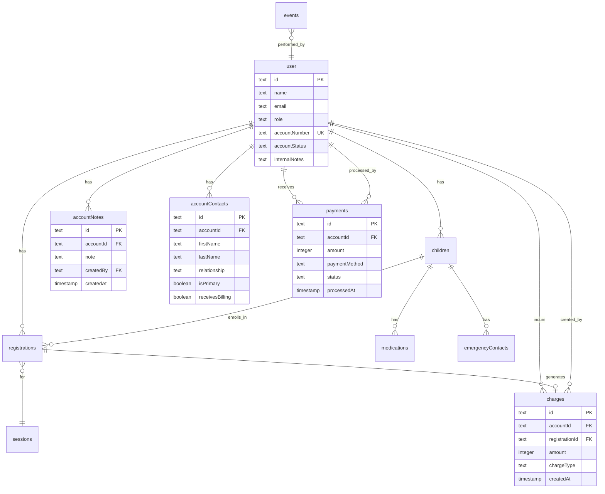

# Account Detail Pages with Comprehensive Management

**Type:** Enhancement
**Priority:** High
**Estimated Complexity:** Large (Multiple tabs, extensive data integration)

---

## Overview

Create comprehensive account detail pages similar to UltraCamp's interface that allow administrators and staff to view and manage all aspects of a camper family's account. This includes viewing individuals (family members), financial information, reservations, communication history, and various management actions through an organized tabbed interface with a More menu for additional capabilities.

**Reference:** UltraCamp-style account detail page with multiple tabs and "More" menu for additional actions.

---

## Problem Statement / Motivation

**Current State:**
- No centralized view of account information
- Account data scattered across multiple pages (children, registrations, sessions)
- Difficult to get complete picture of a family's camp involvement
- No easy way to perform common account management tasks
- Limited visibility into account activity and history

**Desired State:**
- Single comprehensive account detail page
- Organized tabbed navigation for different aspects (individuals, finance, reservations, etc.)
- Quick access to common actions through "More" menu
- Complete audit trail of account activity
- Easy navigation from related entities (registrations, payments) back to account

**Why This Matters:**
- Improves admin/staff efficiency when helping families
- Reduces time to find information during phone calls or in-person interactions
- Enables better customer service with complete context
- Streamlines common workflows (payments, reservations, check-ins)
- Provides audit trail for accountability
- Professional account numbering system for reference

---

## Proposed Solution

Build a multi-tabbed account detail page at `/dashboard/admin/accounts/[accountId]` with the following structure:

### Primary Tabs
1. **Overview** - Account summary with key info (children, balance, recent activity, notes)
2. **Finance** - Detailed payments, charges, balance history
3. **Reservations** - Current and past session registrations
4. **Activity** - Audit log of all account actions

### More Menu Actions
Practical actions accessible through dropdown menu:
- **Make Reservation** - Start new registration flow with account pre-filled
- **Record Payment** - Process payment (manual entry for now, Stripe later)
- **Add Charge** - Add additional fees or charges to account
- **Add Note** - Quick note addition (also available as button on Overview)
- **Edit Contacts** - Manage account-level contacts (different from child emergency contacts)
- **Export Statement** - Generate account statement PDF

---

## Technical Approach

### Data Model Changes

**New Tables:**

```typescript
// Account Notes - Staff notes about the family/account
export const accountNotes = pgTable("account_notes", {
  id: text("id").primaryKey().$defaultFn(() => crypto.randomUUID()),
  accountId: text("account_id").notNull().references(() => user.id, { onDelete: "cascade" }),
  note: text("note").notNull(),
  createdBy: text("created_by").notNull().references(() => user.id),
  createdAt: timestamp("created_at").notNull().defaultNow(),
}, (table) => ({
  accountIdx: index("account_notes_account_idx").on(table.accountId),
  createdAtIdx: index("account_notes_created_at_idx").on(table.createdAt),
}));

// Account Contacts - Account-level contacts (differ from child-specific emergency contacts)
// These are billing contacts, primary account holders, secondary guardians at account level
export const accountContacts = pgTable("account_contacts", {
  id: text("id").primaryKey().$defaultFn(() => crypto.randomUUID()),
  accountId: text("account_id").notNull().references(() => user.id, { onDelete: "cascade" }),
  firstName: text("first_name").notNull(),
  lastName: text("last_name").notNull(),
  relationship: text("relationship").notNull(), // "primary", "spouse", "guardian", "billing"
  phone: text("phone").notNull(),
  email: text("email"),
  isPrimary: boolean("is_primary").notNull().default(false),
  receivesBilling: boolean("receives_billing").notNull().default(false),
  receivesUpdates: boolean("receives_updates").notNull().default(true),
  notes: text("notes"),
  createdAt: timestamp("created_at").notNull().defaultNow(),
  updatedAt: timestamp("updated_at").notNull().defaultNow(),
}, (table) => ({
  accountIdx: index("account_contacts_account_idx").on(table.accountId),
  primaryIdx: index("account_contacts_primary_idx").on(table.accountId, table.isPrimary),
}));

// Payments - Track all payments received (manual now, Stripe later)
export const payments = pgTable("payments", {
  id: text("id").primaryKey().$defaultFn(() => crypto.randomUUID()),
  accountId: text("account_id").notNull().references(() => user.id, { onDelete: "cascade" }),
  amount: integer("amount").notNull(), // in cents
  paymentMethod: text("payment_method").notNull(), // "cash", "check", "card", "stripe"
  referenceNumber: text("reference_number"), // Check number, last 4 digits, etc.
  description: text("description"),
  status: text("status").notNull().default("completed"), // "completed", "pending", "failed", "refunded"
  refundedAmount: integer("refunded_amount").default(0), // in cents
  refundReason: text("refund_reason"),
  stripePaymentIntentId: text("stripe_payment_intent_id"), // For future Stripe integration
  processedBy: text("processed_by").notNull().references(() => user.id),
  processedAt: timestamp("processed_at").notNull().defaultNow(),
  createdAt: timestamp("created_at").notNull().defaultNow(),
}, (table) => ({
  accountIdx: index("payments_account_idx").on(table.accountId),
  statusIdx: index("payments_status_idx").on(table.status),
  processedAtIdx: index("payments_processed_at_idx").on(table.processedAt),
}));

// Charges - Track all charges to account (session fees, additional fees)
export const charges = pgTable("charges", {
  id: text("id").primaryKey().$defaultFn(() => crypto.randomUUID()),
  accountId: text("account_id").notNull().references(() => user.id, { onDelete: "cascade" }),
  registrationId: text("registration_id").references(() => registrations.id, { onDelete: "set null" }),
  amount: integer("amount").notNull(), // in cents
  description: text("description").notNull(),
  chargeType: text("charge_type").notNull(), // "registration", "late_fee", "equipment", "field_trip", "misc"
  createdBy: text("created_by").notNull().references(() => user.id),
  createdAt: timestamp("created_at").notNull().defaultNow(),
}, (table) => ({
  accountIdx: index("charges_account_idx").on(table.accountId),
  registrationIdx: index("charges_registration_idx").on(table.registrationId),
  createdAtIdx: index("charges_created_at_idx").on(table.createdAt),
}));
```

**Schema Enhancements:**

```typescript
// Add account-level fields to user table
export const user = pgTable("user", {
  // ... existing fields
  accountNumber: text("account_number").unique(), // e.g., "A-000001", "A-000234"
  accountStatus: text("account_status").notNull().default("active"), // "active", "inactive"
  internalNotes: text("internal_notes"), // Quick staff notes (supplement to accountNotes table)
});
```

**Note on emergencyContacts vs accountContacts:**
- `emergencyContacts` (existing): Child-specific emergency contacts who can pick up THAT child
- `accountContacts` (new): Account-level billing/admin contacts for the family
- These serve different purposes and should remain separate for clarity and professional organization

### Architecture

**Shared Layout:**
```typescript
// app/(site)/dashboard/admin/accounts/[accountId]/layout.tsx
// Loads account data once, provides to all tabs via React context or props
// Renders AccountHeader and AccountTabsNav
```

**Routes:**
```
app/(site)/dashboard/admin/accounts/
├── page.tsx                    # Account list/search page
├── [accountId]/
│   ├── layout.tsx              # Shared layout (loads account once)
│   ├── page.tsx                # Overview tab (default)
│   ├── finance/
│   │   └── page.tsx            # Finance tab
│   ├── reservations/
│   │   └── page.tsx            # Reservations tab
│   └── activity/
│       └── page.tsx            # Activity log tab
```

**Server Actions (`app/actions/account-actions.ts`):**
```typescript
// Core Data Fetching
- getAccountDetailsAction(accountId) // User + stats + balance
- getAccountFinanceAction(accountId) // Payments + charges
- getAccountReservationsAction(accountId) // Registrations with sessions
- getAccountActivityAction(accountId, filters) // From events table

// Financial Operations
- recordPaymentAction(accountId, paymentData) // Manual payment entry
- addChargeAction(accountId, chargeData) // Add fee/charge
- issueRefundAction(paymentId, amount, reason) // Partial or full refund
- calculateBalanceAction(accountId) // Sum charges - sum payments

// Account Management
- addAccountNoteAction(accountId, note) // Add note
- updateAccountNoteAction(noteId, note) // Edit note
- deleteAccountNoteAction(noteId) // Delete note

// Contact Management
- addAccountContactAction(accountId, contactData) // Add contact
- updateAccountContactAction(contactId, contactData) // Edit contact
- removeAccountContactAction(contactId) // Remove contact
- setPrimaryContactAction(contactId) // Set as primary

// Utility
- generateAccountStatementAction(accountId, dateRange?) // PDF export
- generateAccountNumberAction() // Sequential number generator for new accounts
```

**Components:**
```
src/components/admin/accounts/
├── account-header.tsx              # Account name, number, status badge
├── account-tabs-nav.tsx            # Tab navigation component
├── account-actions-menu.tsx        # More actions dropdown (renamed from "more-menu")
├── account-overview-card.tsx       # Overview tab summary cards
├── children-summary-list.tsx       # Children with medical alerts
├── finance-balance-card.tsx        # Balance summary with breakdown
├── finance-transactions-table.tsx  # Payments and charges table
├── reservations-list.tsx           # Session registrations
├── activity-log.tsx                # Audit trail from events table
├── add-note-dialog.tsx             # Add/edit note dialog
├── record-payment-dialog.tsx       # Record payment dialog
├── add-charge-dialog.tsx           # Add charge dialog
├── edit-contacts-dialog.tsx        # Manage account contacts
└── export-statement-dialog.tsx     # Statement export options
```

### Implementation Phases

#### Phase 1: Foundation & Overview (Week 1)
**Database Setup:**
- [ ] Create migration for new tables: `accountNotes`, `accountContacts`, `payments`, `charges`
- [ ] Add fields to `user` table: `accountNumber`, `accountStatus`, `internalNotes`
- [ ] Create indexes on foreign keys and frequently queried fields
- [ ] Write database seed script to generate account numbers for existing users

**Core Pages:**
- [ ] Create `/app/(site)/dashboard/admin/accounts/page.tsx` - Account list with search
- [ ] Create `/app/(site)/dashboard/admin/accounts/[accountId]/layout.tsx` - Shared layout
- [ ] Create `/app/(site)/dashboard/admin/accounts/[accountId]/page.tsx` - Overview tab
- [ ] Implement `getAccountDetailsAction` - Fetch user, children, balance, recent activity
- [ ] Implement `calculateBalanceAction` - Sum charges minus payments

**Components:**
- [ ] Create `account-header.tsx` - Display account number, name, status badge
- [ ] Create `account-tabs-nav.tsx` - Tab navigation UI
- [ ] Create `account-overview-card.tsx` - Summary cards (balance, children count, etc.)
- [ ] Create `children-summary-list.tsx` - List of children with medical alerts
- [ ] Add breadcrumb navigation from admin dashboard

**Acceptance:**
- [ ] Can navigate to account detail page
- [ ] Overview shows account number, primary contact, balance
- [ ] Overview shows list of children
- [ ] Overview shows recent activity (last 5 events)
- [ ] Tabs navigation is visible and functional

#### Phase 2: Finance Tab (Week 1-2)
**Server Actions:**
- [ ] Implement `getAccountFinanceAction` - Fetch payments and charges with pagination
- [ ] Implement `recordPaymentAction` - Create payment record (manual entry)
- [ ] Implement `addChargeAction` - Create charge record
- [ ] Implement `issueRefundAction` - Update payment with refund amount
- [ ] Add event logging for all financial actions

**Components:**
- [ ] Create `finance-balance-card.tsx` - Balance breakdown (charges, payments, balance)
- [ ] Create `finance-transactions-table.tsx` - Unified payments + charges table
- [ ] Create `record-payment-dialog.tsx` - Form for recording payments
- [ ] Create `add-charge-dialog.tsx` - Form for adding charges
- [ ] Add filtering by date range to transactions table
- [ ] Add "Export Statement" button (placeholder for Phase 4)

**Page:**
- [ ] Create `/app/(site)/dashboard/admin/accounts/[accountId]/finance/page.tsx`
- [ ] Display balance card at top
- [ ] Display transactions table below
- [ ] Add loading states for async operations
- [ ] Add empty state if no transactions

**Acceptance:**
- [ ] Finance tab shows current balance with breakdown
- [ ] Can record manual payment (cash, check, card)
- [ ] Can add additional charge to account
- [ ] Transactions table shows all payments and charges
- [ ] Can filter transactions by date range
- [ ] All financial actions logged to events table

#### Phase 3: Reservations & Notes (Week 2)
**Server Actions:**
- [ ] Implement `getAccountReservationsAction` - Fetch registrations with session details
- [ ] Implement `addAccountNoteAction` - Create note
- [ ] Implement `updateAccountNoteAction` - Edit note
- [ ] Implement `deleteAccountNoteAction` - Delete note
- [ ] Add event logging for note actions

**Components:**
- [ ] Create `reservations-list.tsx` - Registrations grouped by status
- [ ] Create `add-note-dialog.tsx` - Note form (add/edit)
- [ ] Add notes section to Overview tab
- [ ] Add "Add Note" button to Overview tab
- [ ] Add "Make Reservation" link (to existing registration flow)

**Page:**
- [ ] Create `/app/(site)/dashboard/admin/accounts/[accountId]/reservations/page.tsx`
- [ ] Group registrations: Active, Upcoming, Past, Canceled
- [ ] Each registration shows: session name, dates, children, amount, status
- [ ] Link to registration detail page
- [ ] Add empty state if no reservations

**Acceptance:**
- [ ] Reservations tab shows all registrations for account
- [ ] Registrations grouped by status (active, past, canceled)
- [ ] Can click registration to view details
- [ ] Can add note to account from Overview tab
- [ ] Notes display on Overview tab with most recent first
- [ ] Can edit and delete notes

#### Phase 4: Activity Log & More Menu (Week 2-3)
**Server Actions:**
- [ ] Implement `getAccountActivityAction` - Query events table with filters
- [ ] Add pagination support (50 events per page)
- [ ] Add filtering by event type and date range

**Components:**
- [ ] Create `activity-log.tsx` - Audit trail with filtering
- [ ] Create `account-actions-menu.tsx` - More menu dropdown
- [ ] Add filter controls (event type, date range)
- [ ] Add pagination controls
- [ ] Format event data for human readability

**Page:**
- [ ] Create `/app/(site)/dashboard/admin/accounts/[accountId]/activity/page.tsx`
- [ ] Display filterable activity log
- [ ] Show: timestamp, action type, performed by, details
- [ ] Add loading state for log queries
- [ ] Add empty state if no activity

**More Menu Actions:**
- [ ] "Make Reservation" → Link to `/dashboard/admin/registrations/new?accountId=X`
- [ ] "Record Payment" → Open record-payment-dialog
- [ ] "Add Charge" → Open add-charge-dialog
- [ ] "Add Note" → Open add-note-dialog
- [ ] "Edit Contacts" → Open edit-contacts-dialog (Phase 5)
- [ ] "Export Statement" → Open export-statement-dialog (Phase 5)

**Acceptance:**
- [ ] Activity tab shows all account actions
- [ ] Can filter activity by type and date range
- [ ] Activity log paginated (50 per page)
- [ ] More menu accessible from all tabs
- [ ] More menu actions work as expected

#### Phase 5: Contacts & Export (Week 3)
**Server Actions:**
- [ ] Implement `addAccountContactAction` - Create contact
- [ ] Implement `updateAccountContactAction` - Edit contact
- [ ] Implement `removeAccountContactAction` - Delete contact
- [ ] Implement `setPrimaryContactAction` - Mark contact as primary
- [ ] Implement `generateAccountStatementAction` - PDF export (basic version)

**Components:**
- [ ] Create `edit-contacts-dialog.tsx` - Contact management UI
- [ ] Create `export-statement-dialog.tsx` - Statement export options
- [ ] Add contact list display to Overview tab
- [ ] Add "Primary" badge to primary contact
- [ ] Wire up More menu actions for contacts and export

**Acceptance:**
- [ ] Can add account contacts from More menu
- [ ] Can edit and delete account contacts
- [ ] Can set primary contact (only one primary)
- [ ] Primary contact displays on Overview
- [ ] Can export account statement as PDF
- [ ] Statement includes: account info, balance, transactions, registrations

#### Phase 6: Polish & Optimization (Week 3-4)
**Optimizations:**
- [ ] Add database query optimizations (eager loading, select only needed fields)
- [ ] Add caching for balance calculations (if slow)
- [ ] Optimize activity log queries with proper indexes
- [ ] Add optimistic UI updates for note actions

**Polish:**
- [ ] Add comprehensive error handling to all actions
- [ ] Add success toast notifications for all mutations
- [ ] Add empty states for all list views
- [ ] Add loading skeletons for async content
- [ ] Add keyboard shortcuts (optional)
- [ ] Add "Refresh Balance" button to Finance tab
- [ ] Improve mobile responsiveness
- [ ] Add proper focus management for dialogs

**Testing:**
- [ ] Unit tests for balance calculation logic
- [ ] Integration tests for payment/charge workflows
- [ ] E2E tests for critical flows
- [ ] Manual testing with various account scenarios

**Acceptance:**
- [ ] All pages load quickly (<2s initial, <500ms tab switch)
- [ ] No N+1 query problems
- [ ] All actions have proper error handling
- [ ] All mutations show success/error feedback
- [ ] Empty states guide users to next action
- [ ] Interface works on mobile devices

---

## Database Relationships



---

## Acceptance Criteria

### Functional Requirements

**Account List Page:**
- [ ] Admin can view list of all accounts
- [ ] Admin can search accounts by name, email, or account number
- [ ] Admin can filter accounts by status (active/inactive)
- [ ] Admin can sort by account number, name, last activity
- [ ] Clicking account navigates to detail page

**Account Detail - Overview Tab:**
- [ ] Displays account number prominently
- [ ] Shows primary contact name, email, phone
- [ ] Shows current balance (color-coded: green for credit, red for owed)
- [ ] Displays quick stats: # of children, # of active reservations
- [ ] Shows recent activity (last 5 actions from events)
- [ ] Shows recent notes (last 3 notes)
- [ ] "Add Note" button opens dialog to add new note

**Account Detail - Finance Tab:**
- [ ] Displays current balance with breakdown (total charges, total payments, balance)
- [ ] Shows unified transactions table (payments and charges)
- [ ] Each transaction shows: date, type (payment/charge), description, amount
- [ ] "Record Payment" button opens payment dialog
- [ ] "Add Charge" button opens charge dialog
- [ ] Can filter transactions by date range
- [ ] "Export Statement" button generates PDF

**Account Detail - Reservations Tab:**
- [ ] Lists all session registrations for account
- [ ] Groups by status: Active, Upcoming, Past, Canceled
- [ ] Shows: session name, dates, children enrolled, amount, status
- [ ] Each registration is clickable to view registration detail
- [ ] "Make Reservation" button links to registration flow
- [ ] Can filter by child

**Account Detail - Activity Tab:**
- [ ] Shows audit log of all account actions from events table
- [ ] Displays: timestamp, action type, performed by, details
- [ ] Can filter by action type (payment, registration, edit, etc.)
- [ ] Can filter by date range
- [ ] Pagination for logs (50 per page)
- [ ] Events formatted in human-readable way

**More Menu Actions:**
- [ ] "Make Reservation" navigates to registration flow with account pre-filled
- [ ] "Record Payment" opens payment dialog
- [ ] "Add Charge" opens charge dialog
- [ ] "Add Note" opens note dialog
- [ ] "Edit Contacts" opens contacts management dialog
- [ ] "Export Statement" opens statement export dialog

### Non-Functional Requirements

**Performance:**
- [ ] Initial page load under 2 seconds
- [ ] Tab switching under 500ms
- [ ] Search results return within 1 second
- [ ] No N+1 query problems (use eager loading with Drizzle relations)
- [ ] Balance calculation completes in <100ms

**Security:**
- [ ] All actions require authentication via Better Auth
- [ ] Admin role required for all account management features
- [ ] All mutations logged to events table for audit trail
- [ ] No sensitive data (passwords, full card numbers) exposed in UI
- [ ] RBAC enforced via `enforcePermission` helper

**Accessibility:**
- [ ] Keyboard navigation works for all tabs
- [ ] Screen reader announces tab changes
- [ ] All actions have proper ARIA labels
- [ ] Focus indicators visible on all interactive elements
- [ ] Form inputs have associated labels

**User Experience:**
- [ ] Clear visual hierarchy with headings and spacing
- [ ] Loading states for all async operations
- [ ] Error messages are specific and actionable
- [ ] Success confirmations for all actions via toast
- [ ] Empty states guide user to next action
- [ ] Account number prominently displayed for phone reference

---

## Success Metrics

**Efficiency Gains:**
- Reduce time to find account information by 60% (from ~2 minutes to ~45 seconds)
- Reduce clicks to perform common actions (payment, note) by 50%
- Enable staff to reference account number during phone calls

**Adoption:**
- 100% of admin staff using account detail pages within 2 weeks of launch
- 80% reduction in "Where do I find..." questions in staff chat

**Data Quality:**
- 50% increase in account notes being added (better documentation)
- 30% increase in contact information being updated (easier to edit)
- Account numbers used in 90%+ of phone support interactions

---

## Dependencies & Risks

### Dependencies
- Better Auth session management (already implemented)
- RBAC system with admin permission (already implemented)
- Existing children, registrations, sessions data models (already exist)
- Events table for audit logging (already exists)

### Risks & Mitigation

**Risk 1: Balance Calculation Performance**
- **Impact:** Slow page loads if balance query is complex
- **Mitigation:** Start with simple SUM query, add caching or materialized view only if proven slow (>500ms)

**Risk 2: Account Number Generation Conflicts**
- **Impact:** Duplicate account numbers if multiple admins create accounts simultaneously
- **Mitigation:** Use database sequence or UUID-based generation with transaction locks

**Risk 3: Payment/Charge Data Model Evolution**
- **Impact:** When Stripe integration added, may need schema changes
- **Mitigation:** Design with Stripe fields now (stripePaymentIntentId), mark as nullable/unused for manual payments

**Risk 4: emergencyContacts vs accountContacts Confusion**
- **Impact:** Staff might not understand which contact type to use
- **Mitigation:** Clear UI labels ("Account Billing Contacts" vs "Child Emergency Contacts"), add help text

---

## Future Considerations

**Phase 7+ Enhancements:**
- Stripe payment integration (use existing `stripePaymentIntentId` field)
- Automated payment plans with scheduled charges
- Communication tab with email history (when email system exists)
- SMS communication tracking
- Donation/scholarship management
- Account family tree visualization
- Multi-year account history archiving
- Account-level discount codes
- Bulk payment processing (multiple families at once)

---

## References & Research

### Internal References
- Current user schema: `/Users/smroczek/Projects/camp-os/src/lib/schema.ts:20`
- RBAC permissions: `/Users/smroczek/Projects/camp-os/src/lib/rbac.ts:15`
- Admin dashboard pattern: `/Users/smroczek/Projects/camp-os/src/app/(site)/dashboard/admin/page.tsx`
- Server actions pattern: `/Users/smroczek/Projects/camp-os/src/app/actions/admin-actions.ts`
- Dialog component pattern: `/Users/smroczek/Projects/camp-os/src/components/parent/edit-child-dialog.tsx`

### External References
- [Next.js 15 Nested Layouts](https://nextjs.org/docs/app/getting-started/layouts-and-pages)
- [shadcn/ui Tabs Component](https://ui.shadcn.com/docs/components/tabs)
- [Drizzle ORM Relations](https://orm.drizzle.team/docs/rqb#many-to-one)
- [Better Auth Session Management](https://www.better-auth.com/docs/concepts/session-management)

### Design References
- UltraCamp account detail interface (provided screenshots)
- Existing Camp OS admin dashboard patterns

---

## Implementation Notes

**Key Design Decisions:**
1. **Server-side tabs via routes** - Better for SEO, bookmark-able, back button works naturally
2. **Shared layout loads account once** - Prevents redundant queries, improves performance
3. **Balance computed on-demand** - Start simple, optimize later if needed with caching
4. **Admin-only initially** - Phase 1-6 are admin tools, parent-facing portal is separate feature
5. **Event sourcing for audit** - All account mutations logged to events table
6. **Professional account numbering** - Sequential account numbers (A-000001, A-000002, etc.)
7. **Separate contact types** - Account contacts (billing) vs emergency contacts (child pickup) serve different purposes
8. **Payment infrastructure ready** - Tables designed for manual entry now, Stripe integration later

**Database Migration Strategy:**
1. Create new tables: `accountNotes`, `accountContacts`, `payments`, `charges`
2. Add new fields to `user` table: `accountNumber`, `accountStatus`, `internalNotes`
3. Create indexes on all foreign keys for query performance
4. Generate account numbers for all existing users (sequential: A-000001, A-000002, etc.)
5. Add unique constraint on `user.accountNumber`

**Account Number Format:**
- Format: `A-XXXXXX` where X is zero-padded number (e.g., A-000001, A-000234)
- Generated sequentially for professional appearance
- Easy to reference over phone
- Unique constraint enforced at database level

**Testing Strategy:**
- Unit tests for balance calculation logic (sum charges - sum payments)
- Unit tests for account number generation (no duplicates)
- Integration tests for payment/charge workflows
- Integration tests for tab navigation and data loading
- E2E tests for critical flows (record payment, add note, view statement)
- Manual testing with various account scenarios (new account, high activity, zero balance)

---

**Priority:** Implement phases 1-4 first (foundation through activity log and More menu) to provide core value. Phases 5-6 (contacts and polish) can be prioritized based on user feedback and most commonly requested features.