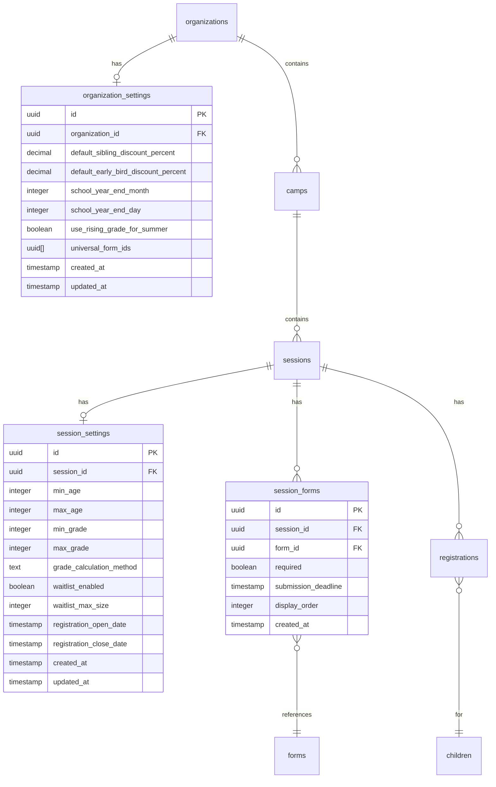

# Robust Session Management & AI-Assisted Camp Setup

**Created:** 2025-12-18
**Type:** Feature Enhancement
**Priority:** Critical (Phase 3 Foundation)
**Estimated Complexity:** High - Multi-phase implementation

---

## Overview

Transform Camp OS's session management from a minimal MVP to a robust, AI-first platform that rivals UltraCamp and CampMinder. This plan addresses the confusion around camps vs sessions terminology, adds comprehensive settings management at both organization and session levels, implements age/grade-based restrictions with school year awareness, and introduces AI-assisted setup to help camps get configured quickly.

### Problem Statement

The current session creation is "too light and confusing":
1. **Terminology confusion**: "Manage Camps" shows sessions; relationship between camps and sessions is unclear
2. **Minimal session configuration**: Only basic fields (dates, price, capacity, status)
3. **No settings architecture**: No organization-level or session-level settings beyond basic fields
4. **No form attachment during creation**: Must create session first, then separately attach forms
5. **No age/grade restrictions**: Cannot filter eligibility by age or grade level
6. **No school year awareness**: No concept of "rising grade" vs "current grade" for summer camps
7. **No AI assistance**: Manual setup only, no intelligent suggestions or guided wizards

### Proposed Solution

A comprehensive enhancement organized into 5 phases:
1. **Phase 1**: Clarify terminology and improve navigation (camps = programs, sessions = instances)
2. **Phase 2**: Build settings architecture (org-level and session-level)
3. **Phase 3**: Implement eligibility system (age/grade restrictions with school year logic)
4. **Phase 4**: Create session creation wizard with form attachment
5. **Phase 5**: Add AI-assisted setup wizard

---

## Technical Approach

### Current Architecture

**Existing Schema** (`src/lib/schema.ts`):
```
Organizations (1) → Camps (N) → Sessions (N) → Registrations (N)
                                     ↓
                               Forms (via forms.sessionId or forms.campId)
```

**Current Session Fields** (lines 192-215):
- `id`, `organizationId`, `campId`, `startDate`, `endDate`, `price`, `capacity`, `status`, `createdAt`

**Current Camp Fields** (lines 174-190):
- `id`, `organizationId`, `name`, `description`, `location`, `capacity`, `createdAt`

### Proposed Architecture

```
Organizations (1) → OrgSettings (1)
         ↓
      Camps (N) → CampSettings (1)
         ↓
    Sessions (N) → SessionSettings (1) → SessionForms (N) → Forms
         ↓
   Registrations (N) → Children (with eligibility calculated)
```

---

## Implementation Phases

### Phase 1: Terminology & Navigation Clarity

**Goal**: Make the relationship between camps and sessions immediately clear

#### Tasks

1. **Rename UI labels**:
   - "Manage Camps" → "Programs & Sessions"
   - Sidebar: Add "Programs" and "Sessions" as separate nav items
   - Cards: Show "Program: [Camp Name]" with sessions nested below

2. **Update admin camps page** (`src/app/(site)/dashboard/admin/camps/page.tsx`):
   - Rename page title to "Programs & Sessions"
   - Add explanatory text: "Programs are reusable camp types. Sessions are specific dates and offerings."
   - Improve visual hierarchy: Programs as cards, sessions as nested rows

3. **Update camp card display**:
   - Show program stats (total sessions, total capacity, total registrations)
   - Clear "Add Session" CTA with context

4. **Add sessions listing page** (`src/app/(site)/dashboard/admin/sessions/page.tsx`):
   - Flat view of all sessions across programs
   - Filterable by program, status, date range
   - Quick actions: edit, duplicate, view registrations

#### Files to Modify

- `src/app/(site)/dashboard/admin/camps/page.tsx:1-270` - Rename to Programs & Sessions
- `src/app/(site)/dashboard/admin/page.tsx:1-337` - Update dashboard terminology
- `src/components/admin/create-camp-dialog.tsx:1-134` - Rename to "Create Program"
- `src/components/admin/create-session-dialog.tsx:1-186` - Update labels

#### Success Criteria

- [ ] Admin understands camps = programs, sessions = offerings at a glance
- [ ] Navigation clearly separates program management from session management
- [ ] Onboarding tooltip explains the relationship

---

### Phase 2: Settings Architecture

**Goal**: Build comprehensive org-level and session-level settings with inheritance

#### Database Schema Additions

```typescript
// src/lib/schema.ts

// Organization Settings (stored as JSONB for flexibility)
export const organizationSettings = pgTable("organization_settings", {
  id: uuid("id").defaultRandom().primaryKey(),
  organizationId: uuid("organization_id")
    .references(() => organizations.id, { onDelete: "cascade" })
    .unique()
    .notNull(),

  // Financial Settings
  defaultSiblingDiscountPercent: decimal("default_sibling_discount_percent", { precision: 5, scale: 2 }).default("0"),
  defaultEarlyBirdDiscountPercent: decimal("default_early_bird_discount_percent", { precision: 5, scale: 2 }).default("0"),
  defaultMultiWeekDiscountPercent: decimal("default_multi_week_discount_percent", { precision: 5, scale: 2 }).default("0"),
  maxDiscountCapPercent: decimal("max_discount_cap_percent", { precision: 5, scale: 2 }).default("50"),
  discountStackingEnabled: boolean("discount_stacking_enabled").default(true),

  // Refund Policy
  fullRefundDaysBefore: integer("full_refund_days_before").default(30),
  partialRefundDaysBefore: integer("partial_refund_days_before").default(14),
  partialRefundPercent: decimal("partial_refund_percent", { precision: 5, scale: 2 }).default("50"),
  noRefundDaysBefore: integer("no_refund_days_before").default(7),

  // Operational Settings
  schoolYearEndMonth: integer("school_year_end_month").default(6), // June
  schoolYearEndDay: integer("school_year_end_day").default(15),
  useRisingGradeForSummer: boolean("use_rising_grade_for_summer").default(true),
  defaultStaffToChildRatio: text("default_staff_to_child_ratio").default("1:8"),
  registrationOpenDaysBefore: integer("registration_open_days_before").default(90),

  // Form Settings
  universalFormIds: uuid("universal_form_ids").array(), // Forms auto-attached to all sessions
  formReminderDaysBefore: integer("form_reminder_days_before").default(7),

  // Communication Settings
  senderEmail: text("sender_email"),
  senderName: text("sender_name"),
  emailFooter: text("email_footer"),

  // Metadata
  createdAt: timestamp("created_at").defaultNow().notNull(),
  updatedAt: timestamp("updated_at").defaultNow().notNull(),
});

// Session Settings (overrides org settings when present)
export const sessionSettings = pgTable("session_settings", {
  id: uuid("id").defaultRandom().primaryKey(),
  sessionId: uuid("session_id")
    .references(() => sessions.id, { onDelete: "cascade" })
    .unique()
    .notNull(),

  // Eligibility Restrictions
  minAge: integer("min_age"),
  maxAge: integer("max_age"),
  minGrade: integer("min_grade"), // 0 = K, 1-12 = grades 1-12, -1 = PreK
  maxGrade: integer("max_grade"),
  gradeCalculationMethod: text("grade_calculation_method").default("rising"), // "rising" | "current" | "completed"
  ageCalculationDate: text("age_calculation_date").default("session_start"), // "session_start" | "registration" | "custom"
  customAgeCalculationDate: timestamp("custom_age_calculation_date"),
  genderRestriction: text("gender_restriction"), // null = any, "male", "female"

  // Capacity Settings
  genderCapacityMale: integer("gender_capacity_male"),
  genderCapacityFemale: integer("gender_capacity_female"),
  waitlistEnabled: boolean("waitlist_enabled").default(true),
  waitlistMaxSize: integer("waitlist_max_size").default(20),
  waitlistClaimHours: integer("waitlist_claim_hours").default(48),

  // Pricing Overrides (null = use org default)
  siblingDiscountOverride: decimal("sibling_discount_override", { precision: 5, scale: 2 }),
  earlyBirdDiscountOverride: decimal("early_bird_discount_override", { precision: 5, scale: 2 }),
  earlyBirdDeadline: timestamp("early_bird_deadline"),

  // Registration Window
  registrationOpenDate: timestamp("registration_open_date"),
  registrationCloseDate: timestamp("registration_close_date"),
  allowLateRegistration: boolean("allow_late_registration").default(false),
  lateRegistrationFee: decimal("late_registration_fee", { precision: 10, scale: 2 }),

  // Refund Policy Overrides (null = use org default)
  customRefundPolicy: boolean("custom_refund_policy").default(false),
  fullRefundDaysBeforeOverride: integer("full_refund_days_before_override"),

  // Session-Specific Details
  sessionDescription: text("session_description"),
  sessionImage: text("session_image"),
  specialInstructions: text("special_instructions"),
  whatToBring: text("what_to_bring"),

  // Metadata
  createdAt: timestamp("created_at").defaultNow().notNull(),
  updatedAt: timestamp("updated_at").defaultNow().notNull(),
});

// Junction table for session-form assignments
export const sessionForms = pgTable(
  "session_forms",
  {
    id: uuid("id").defaultRandom().primaryKey(),
    sessionId: uuid("session_id")
      .references(() => sessions.id, { onDelete: "cascade" })
      .notNull(),
    formId: uuid("form_id")
      .references(() => forms.id, { onDelete: "cascade" })
      .notNull(),
    required: boolean("required").default(true),
    submissionDeadline: timestamp("submission_deadline"),
    deadlineType: text("deadline_type").default("before_session"), // "before_session" | "before_registration" | "custom"
    displayOrder: integer("display_order").default(0),
    createdAt: timestamp("created_at").defaultNow().notNull(),
  },
  (table) => ({
    sessionFormIdx: uniqueIndex("session_form_unique").on(table.sessionId, table.formId),
    sessionIdx: index("session_forms_session_idx").on(table.sessionId),
    formIdx: index("session_forms_form_idx").on(table.formId),
  })
);
```

#### Settings UI Components

1. **Organization Settings Page** (`src/app/(site)/dashboard/admin/settings/page.tsx`):
   - Tabs: General, Financial, Forms, Communication, Advanced
   - Each tab contains relevant settings with clear descriptions
   - "Reset to defaults" option per section

2. **Session Settings Panel** (embedded in session edit):
   - Collapsible sections matching org settings
   - Toggle: "Use organization default" vs "Custom value"
   - Visual indicator when overriding org setting

#### Files to Create

- `src/lib/schema.ts` - Add settings tables (append to existing)
- `src/app/(site)/dashboard/admin/settings/page.tsx` - New org settings page
- `src/app/(site)/dashboard/admin/settings/layout.tsx` - Settings layout with tabs
- `src/components/admin/settings/general-settings-form.tsx`
- `src/components/admin/settings/financial-settings-form.tsx`
- `src/components/admin/settings/form-settings.tsx`
- `src/components/admin/settings/communication-settings.tsx`
- `src/components/admin/session-settings-panel.tsx`
- `src/app/actions/settings-actions.ts` - Server actions for settings CRUD

#### Success Criteria

- [ ] Admins can configure organization-wide defaults
- [ ] Session-level settings can override org defaults
- [ ] Clear visual indication of which settings are inherited vs custom
- [ ] Settings changes validated and saved with audit trail

---

### Phase 3: Eligibility System (Age/Grade Restrictions)

**Goal**: Implement comprehensive age and grade-based eligibility with school year awareness

#### Eligibility Calculation Logic

```typescript
// src/services/eligibility-service.ts

interface EligibilityResult {
  eligible: boolean;
  reason?: string;
  calculatedAge: number;
  calculatedGrade: number;
  gradeMethod: "rising" | "current" | "completed";
}

export function calculateEligibility(
  child: { birthDate: Date; currentGrade: number },
  session: {
    startDate: Date;
    settings: SessionSettings;
  },
  orgSettings: OrganizationSettings
): EligibilityResult {
  // Calculate age
  const ageAtDate = getAgeCalculationDate(session);
  const age = calculateAge(child.birthDate, ageAtDate);

  // Calculate grade
  const gradeMethod = session.settings.gradeCalculationMethod || "rising";
  const grade = calculateGradeForMethod(
    child.currentGrade,
    session.startDate,
    orgSettings,
    gradeMethod
  );

  // Check age eligibility
  if (session.settings.minAge && age < session.settings.minAge) {
    return {
      eligible: false,
      reason: `Child must be at least ${session.settings.minAge} years old`,
      calculatedAge: age,
      calculatedGrade: grade,
      gradeMethod,
    };
  }

  if (session.settings.maxAge && age > session.settings.maxAge) {
    return {
      eligible: false,
      reason: `Child must be ${session.settings.maxAge} or younger`,
      calculatedAge: age,
      calculatedGrade: grade,
      gradeMethod,
    };
  }

  // Check grade eligibility
  if (session.settings.minGrade != null && grade < session.settings.minGrade) {
    const gradeLabel = getGradeLabel(session.settings.minGrade);
    return {
      eligible: false,
      reason: `Child must be in ${gradeLabel} or higher (${gradeMethod} grade)`,
      calculatedAge: age,
      calculatedGrade: grade,
      gradeMethod,
    };
  }

  if (session.settings.maxGrade != null && grade > session.settings.maxGrade) {
    const gradeLabel = getGradeLabel(session.settings.maxGrade);
    return {
      eligible: false,
      reason: `Child must be in ${gradeLabel} or lower (${gradeMethod} grade)`,
      calculatedAge: age,
      calculatedGrade: grade,
      gradeMethod,
    };
  }

  return {
    eligible: true,
    calculatedAge: age,
    calculatedGrade: grade,
    gradeMethod,
  };
}

function calculateGradeForMethod(
  currentGrade: number,
  sessionStartDate: Date,
  orgSettings: OrganizationSettings,
  method: "rising" | "current" | "completed"
): number {
  const schoolYearEnd = new Date(
    sessionStartDate.getFullYear(),
    orgSettings.schoolYearEndMonth - 1, // 0-indexed
    orgSettings.schoolYearEndDay
  );

  // Adjust for sessions that start before school year end
  if (sessionStartDate < schoolYearEnd) {
    // Session starts during school year
    switch (method) {
      case "current":
        return currentGrade;
      case "rising":
        return currentGrade + 1; // Rising = entering next year
      case "completed":
        return currentGrade - 1; // Completed = finished previous year
    }
  } else {
    // Session starts after school year end (summer)
    switch (method) {
      case "current":
        return currentGrade + 1; // Current = new grade after promotion
      case "rising":
        return currentGrade + 1; // Rising = entering next year (same as current for summer)
      case "completed":
        return currentGrade; // Completed = just finished this grade
    }
  }
}

function getGradeLabel(grade: number): string {
  if (grade === -1) return "Pre-K";
  if (grade === 0) return "Kindergarten";
  if (grade <= 12) return `Grade ${grade}`;
  return "Graduated";
}
```

#### UI Components for Eligibility

1. **Session Eligibility Settings**:
   - Age range inputs (min/max with +/- buttons)
   - Grade range dropdowns (Pre-K through 12th + Graduated)
   - Grade calculation method selector with explanations
   - Preview: "This session is for children ages 8-12, entering grades 3-6"

2. **Parent-Facing Eligibility Display**:
   - Green checkmark: "Your child is eligible"
   - Yellow warning: "Your child will be eligible on [date]"
   - Red X: "Your child is not eligible because [reason]"
   - For multiple children: Show eligibility per child

#### Files to Create/Modify

- `src/services/eligibility-service.ts` - Eligibility calculation logic
- `src/components/admin/eligibility-settings.tsx` - Admin UI for settings
- `src/components/parent/eligibility-badge.tsx` - Parent-facing indicator
- `src/components/parent/session-card.tsx:*` - Add eligibility display
- `src/app/actions/eligibility-actions.ts` - Check eligibility server action

#### Success Criteria

- [ ] Admins can set age and/or grade restrictions per session
- [ ] Grade calculation respects school year settings
- [ ] Parents see clear eligibility status for each child
- [ ] Ineligible children blocked from registration with helpful message

---

### Phase 4: Session Creation Wizard with Form Attachment

**Goal**: Create a comprehensive multi-step wizard for session creation

#### Wizard Steps

```
Step 1: Basic Information
├── Select program (camp) OR create new
├── Session name (auto-generated suggestion: "[Camp Name] - [Dates]")
├── Date range picker (start/end)
└── Session description (optional)

Step 2: Capacity & Eligibility
├── Total capacity (number input)
├── Gender-specific capacity (optional toggle)
├── Age restrictions (min/max, optional)
├── Grade restrictions (min/max, optional)
├── Grade calculation method (rising/current/completed)
└── Preview: "Ages 8-12, Grades 3-6 (rising)"

Step 3: Pricing & Discounts
├── Base price
├── Early bird discount (toggle, percentage, deadline)
├── Sibling discount (use org default or override)
├── Multi-week discount (if applicable)
└── Payment plans (future: enable/configure)

Step 4: Required Forms
├── Organization universal forms (auto-attached, shown as info)
├── Available forms list (checkboxes to attach)
├── + Create New Form button (opens form builder in modal)
├── Per-form settings: Required vs Optional, Deadline
└── Drag-and-drop reordering

Step 5: Registration Settings
├── Registration window (open/close dates)
├── Waitlist settings (enabled, max size, claim window)
├── Late registration (allow, fee)
└── Special instructions / What to bring

Step 6: Review & Create
├── Summary card with all settings
├── Validation warnings (missing required fields)
├── Save as Draft OR Publish
└── Copy link to share
```

#### Component Structure

```typescript
// src/components/admin/session-wizard/session-creation-wizard.tsx

const WIZARD_STEPS = [
  { id: 1, title: "Basic Info", component: BasicInfoStep },
  { id: 2, title: "Capacity & Eligibility", component: CapacityStep },
  { id: 3, title: "Pricing", component: PricingStep },
  { id: 4, title: "Forms", component: FormsStep },
  { id: 5, title: "Registration", component: RegistrationStep },
  { id: 6, title: "Review", component: ReviewStep },
];

export function SessionCreationWizard({ campId?: string }) {
  const [step, setStep] = useState(1);
  const methods = useForm<SessionWizardData>({
    resolver: zodResolver(sessionWizardSchema),
    mode: "onChange",
  });

  // ... implementation
}
```

#### Files to Create

- `src/app/(site)/dashboard/admin/sessions/new/page.tsx` - Wizard page
- `src/components/admin/session-wizard/session-creation-wizard.tsx` - Main wizard
- `src/components/admin/session-wizard/steps/basic-info-step.tsx`
- `src/components/admin/session-wizard/steps/capacity-step.tsx`
- `src/components/admin/session-wizard/steps/pricing-step.tsx`
- `src/components/admin/session-wizard/steps/forms-step.tsx`
- `src/components/admin/session-wizard/steps/registration-step.tsx`
- `src/components/admin/session-wizard/steps/review-step.tsx`
- `src/components/admin/session-wizard/wizard-progress.tsx` - Progress indicator
- `src/components/admin/session-wizard/form-attachment-list.tsx` - Form selection UI
- `src/app/actions/session-wizard-actions.ts` - Create session with all settings

#### Success Criteria

- [ ] Complete session creation in single workflow (no separate steps)
- [ ] Forms can be attached (or created) during session creation
- [ ] All eligibility and pricing settings configurable
- [ ] Review step shows complete summary before creation
- [ ] Save as draft functionality works
- [ ] Validation prevents incomplete sessions from publishing

---

### Phase 5: AI-Assisted Setup Wizard

**Goal**: Let AI help camps get set up quickly with intelligent suggestions

#### AI Setup Flow

```
User: "I want to create a summer STEM camp for middle schoolers"

AI Assistant: "I'll help you set up your STEM camp! Let me ask a few questions:"

1. "What's the age range? (typical for middle school: 11-14)"
   → User confirms or adjusts

2. "How long is each session - day camp or multi-week?"
   → User: "Week-long day camps"

3. "What dates are you considering?"
   → User: "June through August"

AI Generates:
- 10 sessions (10 weeks of summer)
- Capacity suggestion: 30 (based on STEM camp ratios)
- Pricing suggestion: $450/week (regional average)
- Recommended forms: Medical, Liability Waiver, Tech Use Agreement
- Age/grade: 11-14 years, rising 6th-8th grade
```

#### AI Integration Architecture

```typescript
// src/app/api/ai/session-setup/route.ts

export async function POST(req: Request) {
  const { messages, organizationId } = await req.json();

  // Get org context for personalized suggestions
  const orgContext = await getOrganizationContext(organizationId);

  const result = streamText({
    model: openai("gpt-4o"),
    system: buildSystemPrompt(orgContext),
    messages,
    tools: {
      suggestSessionConfiguration: {
        description: "Suggest complete session configuration based on camp type",
        inputSchema: z.object({
          campType: z.enum(["day_camp", "overnight", "specialty", "sports", "arts", "stem", "adventure"]),
          ageRange: z.object({ min: z.number(), max: z.number() }),
          gradeRange: z.object({ min: z.number(), max: z.number() }),
          duration: z.enum(["half_day", "full_day", "multi_day", "week", "multi_week"]),
          dateRange: z.object({ start: z.string(), end: z.string() }),
        }),
        execute: async (input) => {
          return generateSessionSuggestions(input, orgContext);
        },
      },
      generateSessionBatch: {
        description: "Generate multiple sessions at once",
        inputSchema: z.object({
          template: z.any(), // Session template
          count: z.number(),
          startDate: z.string(),
          interval: z.enum(["daily", "weekly", "biweekly"]),
        }),
        execute: async (input) => {
          return generateSessionBatch(input);
        },
      },
      recommendForms: {
        description: "Recommend forms based on camp type and activities",
        inputSchema: z.object({
          campType: z.string(),
          activities: z.array(z.string()),
          ageRange: z.object({ min: z.number(), max: z.number() }),
        }),
        execute: async (input) => {
          return recommendFormsForCamp(input, orgContext.existingForms);
        },
      },
    },
  });

  return result.toDataStreamResponse();
}
```

#### AI Setup UI

```typescript
// src/components/admin/ai-setup/ai-session-setup.tsx

export function AISessionSetup() {
  const { messages, input, handleSubmit, isLoading } = useChat({
    api: "/api/ai/session-setup",
    onToolCall: ({ toolCall }) => {
      // Handle tool results to update preview
      if (toolCall.toolName === "suggestSessionConfiguration") {
        setPreviewSessions(toolCall.result.sessions);
      }
    },
  });

  return (
    <div className="grid grid-cols-2 gap-6">
      {/* Left: Chat interface */}
      <Card>
        <CardHeader>
          <CardTitle>AI Setup Assistant</CardTitle>
          <CardDescription>
            Tell me about your camp and I'll help you get set up
          </CardDescription>
        </CardHeader>
        <CardContent>
          <ChatMessages messages={messages} />
          <ChatInput
            value={input}
            onChange={handleInputChange}
            onSubmit={handleSubmit}
            placeholder="Describe your camp..."
          />
        </CardContent>
      </Card>

      {/* Right: Preview of AI-generated sessions */}
      <Card>
        <CardHeader>
          <CardTitle>Preview</CardTitle>
          <CardDescription>
            Review and modify AI suggestions
          </CardDescription>
        </CardHeader>
        <CardContent>
          {previewSessions.map((session) => (
            <SessionPreviewCard
              key={session.id}
              session={session}
              onEdit={handleEditSession}
              onRemove={handleRemoveSession}
            />
          ))}
        </CardContent>
        <CardFooter>
          <Button onClick={handleCreateAll}>
            Create {previewSessions.length} Sessions
          </Button>
        </CardFooter>
      </Card>
    </div>
  );
}
```

#### Files to Create

- `src/app/api/ai/session-setup/route.ts` - AI streaming endpoint
- `src/components/admin/ai-setup/ai-session-setup.tsx` - Main AI setup UI
- `src/components/admin/ai-setup/chat-interface.tsx` - Chat component
- `src/components/admin/ai-setup/session-preview-card.tsx` - Session preview
- `src/components/admin/ai-setup/suggestion-acceptance.tsx` - Accept/modify UI
- `src/services/ai-session-suggestions.ts` - AI suggestion generation logic
- `src/lib/ai/camp-knowledge.ts` - Camp domain knowledge for AI context

#### Success Criteria

- [ ] Natural language input accepted ("I want to run a sports camp")
- [ ] AI generates complete session configurations
- [ ] Suggestions include pricing, capacity, eligibility, forms
- [ ] Admin can review and modify before accepting
- [ ] Batch session creation supported (10 weeks at once)
- [ ] AI explanations for suggestions ("Based on similar sports camps...")

---

## Acceptance Criteria

### Functional Requirements

- [ ] Camp/session terminology is clear throughout the admin interface
- [ ] Organization-level settings persist and apply as defaults
- [ ] Session-level settings can override org defaults with visual indication
- [ ] Age and grade restrictions filter parent session views
- [ ] Grade calculation respects school year configuration
- [ ] Session creation wizard completes full setup in one flow
- [ ] Forms can be attached and created during session creation
- [ ] AI assistant can generate session configurations from descriptions
- [ ] Batch session creation works for multi-week programs

### Non-Functional Requirements

- [ ] Settings pages load in under 1 second
- [ ] Wizard state persists if user navigates away (auto-save draft)
- [ ] AI suggestions generate within 5 seconds
- [ ] All settings changes are audited in events table
- [ ] Mobile-responsive settings and wizard interfaces

### Quality Gates

- [ ] TypeScript strict mode passes
- [ ] ESLint passes with no warnings
- [ ] All new server actions have RBAC checks
- [ ] All database queries filter by organizationId
- [ ] Settings validation prevents invalid configurations

---

## Dependencies & Prerequisites

### Technical Dependencies

1. **Drizzle migrations** - New tables for settings and session_forms
2. **OpenAI API key** - For AI-assisted setup (already available)
3. **Form builder** - Existing form builder for inline form creation

### Data Dependencies

1. **Existing organizations** - Must have at least one test organization
2. **Existing camps** - For session creation testing
3. **Existing forms** - For form attachment testing

### External Dependencies

None - all features use existing technology stack.

---

## Risk Analysis & Mitigation

### High Risk

**Risk**: Pricing/discount logic complexity leads to incorrect calculations
**Impact**: Revenue loss, customer complaints
**Mitigation**: Extensive test coverage, admin preview of final prices, audit trail

**Risk**: Grade calculation edge cases cause eligibility errors
**Impact**: Children incorrectly included/excluded from sessions
**Mitigation**: Clear UI showing calculated grade, admin override capability

### Medium Risk

**Risk**: AI suggestions are unhelpful or incorrect
**Impact**: Admins don't use feature, wasted development
**Mitigation**: Start simple, iterate based on feedback, always allow manual editing

**Risk**: Settings inheritance is confusing
**Impact**: Admins frustrated, incorrect configurations
**Mitigation**: Clear visual indicators, "inherited from org" labels, good defaults

### Low Risk

**Risk**: Wizard is too long/complex
**Impact**: Abandonment during session creation
**Mitigation**: Auto-save drafts, skip optional steps, smart defaults

---

## ERD: New Schema Relationships



---

## References & Research

### Internal References

- Database schema: `src/lib/schema.ts:174-215` (camps and sessions)
- Admin camps page: `src/app/(site)/dashboard/admin/camps/page.tsx:1-270`
- Create session dialog: `src/components/admin/create-session-dialog.tsx:1-186`
- Parent registration: `src/components/parent/register-session-dialog.tsx:1-166`
- Form builder: `src/components/forms/form-builder/`

### External References

- [UltraCamp Features](https://ultracampmanagement.com/home/features/)
- [CampMinder Registration](https://campminder.com/features/registration-forms/)
- [Camp Software Best Practices](https://blog.circuitree.com/camp-management-toolkit)
- [Better Auth Organization Plugin](https://www.better-auth.com/docs/plugins/organization)
- [Vercel AI SDK](https://ai-sdk.dev/docs/introduction)
- [shadcn/ui Multi-Step Forms](https://ui.shadcn.com/docs/forms/react-hook-form)

### Industry Standards

- Rising grade typically used for summer camps (entering fall grade)
- Common sibling discounts: 5-15% per additional child
- Common early bird: 10-20% off before deadline
- Medical forms + Liability waiver = minimum required forms
- Session capacity typically 20-40 for day camps

---

## Questions Requiring Clarification

Before implementation, the following decisions need stakeholder input:

### Critical (Blocks Implementation)

1. **Discount Stacking**: Can multiple discounts apply (e.g., early bird + sibling + multi-week)?
   - If yes, what order? What's the max cap?
   - Recommendation: Stack with 50% max cap

2. **Payment Plans**: Are installment plans in scope for this phase?
   - If yes, need full payment plan specification
   - Recommendation: Defer to future phase, implement deposit-only first

3. **Form Deadlines**: What happens if forms incomplete at deadline?
   - Hard block? Soft warning? Admin notification?
   - Recommendation: Soft deadline with admin notification

4. **Capacity Changes**: Can capacity be reduced below current registrations?
   - If yes, who's removed? How handled?
   - Recommendation: Block reduction below current count

### Important (Affects UX)

5. **AI Scope**: Should AI generate forms or just recommend existing?
   - Full generation is complex; recommendation is simpler
   - Recommendation: Start with recommendations, add generation later

6. **Multi-Location**: Do organizations have multiple physical locations?
   - Affects settings architecture significantly
   - Recommendation: Single location for now, plan for multi-location

---

## MVP Scope

For initial implementation, focus on:

**Phase 1** (Week 1-2): Terminology + Navigation
**Phase 2** (Week 2-4): Settings Architecture (org + session)
**Phase 3** (Week 4-5): Eligibility System
**Phase 4** (Week 5-7): Session Creation Wizard

**Phase 5** (Post-MVP): AI-Assisted Setup

This allows the core session management to be robust and functional before adding AI enhancement.
