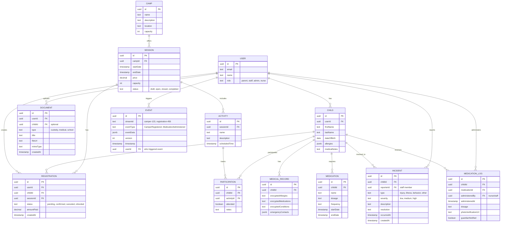

# Camp OS: Three-Surface Platform for Modern Camp Management

**Type:** Feature / New Platform
**Status:** Planning
**Created:** 2025-12-15
**Complexity:** High (Multi-surface, real-time, AI-powered configuration)
**Prototype Level:** Functional (not production-ready)
**Target Scale:** Small camp (50-200 children per session)
**AI-First:** Admin config assistant, conversational parent enrollment, voice-to-text staff reports

---

## Overview

Build a unified camp management platform with three interconnected surfaces:
1. **Parent/Guardian Web App** (mobile-first): Registration, real-time updates, daily digests
2. **Staff Mobile App** (PWA offline-first): Check-in, attendance, incident reporting, one-tap workflows
3. **Admin Operations Console** (desktop): Demand forecasting, compliance, staffing, real-time operations

The platform uses **event-driven architecture** for complete audit trails, **AI copilots** with human approval guardrails, and a **shared real-time "camp state"** across all surfaces.

---

## Problem Statement

Modern camp management requires:
- **Parents** expect airline/package-tracking-style transparency (real-time status, instant answers, easy payments)
- **Staff** need offline-first mobile tools (spotty connectivity, minimal text entry, safety guardrails)
- **Admins** require operational intelligence (forecasting, compliance at a glance, real-time camp state)

Current camp software fails because:
- Fragmented systems (registration ≠ operations ≠ parent communication)
- Poor mobile experiences for staff (online-only, clunky data entry)
- No real-time coordination across stakeholders
- Opaque processes for parents (hunt through PDFs, no status visibility)

---

## Proposed Solution

### Architecture Overview

```
┌─────────────────────────────────────────────────────────┐
│                    Next.js 15 App Router                 │
├─────────────────────────────────────────────────────────┤
│                                                          │
│  ┌──────────────┐  ┌──────────────┐  ┌──────────────┐  │
│  │   Parent     │  │    Staff     │  │    Admin     │  │
│  │   Portal     │  │  Mobile App  │  │   Console    │  │
│  │  (RSC-heavy) │  │  (PWA/Cap)   │  │  (Dashboard) │  │
│  └──────────────┘  └──────────────┘  └──────────────┘  │
│         │                  │                  │          │
├─────────┴──────────────────┴──────────────────┴─────────┤
│              Server Components + Server Actions          │
├─────────────────────────────────────────────────────────┤
│  ┌──────────────┐  ┌──────────────┐  ┌──────────────┐  │
│  │   General    │  │   Medical    │  │    Event     │  │
│  │   Service    │  │   Service    │  │   Store      │  │
│  │              │  │  (Isolated)  │  │  (Audit)     │  │
│  └──────────────┘  └──────────────┘  └──────────────┘  │
├─────────────────────────────────────────────────────────┤
│              Drizzle ORM + PostgreSQL                    │
└─────────────────────────────────────────────────────────┘
           │                  │                  │
    ┌──────┴──────┐    ┌──────┴──────┐    ┌─────┴─────┐
    │    SSE      │    │  IndexedDB  │    │    AI     │
    │ Real-Time   │    │  (Offline)  │    │  Copilot  │
    └─────────────┘    └─────────────┘    └───────────┘
```

### Core Technology Stack

| Feature | Technology | Rationale |
|---------|-----------|-----------|
| Framework | Next.js 15 App Router | Already in stack, Server Components |
| Auth | Better Auth + RBAC | Role-based for parent/staff/admin/nurse |
| Database | PostgreSQL + Drizzle ORM | Relational data, type-safe |
| Forms | React Hook Form + Zod | Already installed, multi-step support |
| File Upload | Vercel Blob | Already installed, simple API |
| Payments | Stripe | Industry standard |
| Real-Time | Server-Sent Events (SSE) | Native Next.js, automatic reconnection |
| Offline | Service Worker + IndexedDB | PWA offline-first for staff mobile |
| Background Jobs | Vercel Cron Jobs | Built-in, no extra dependencies |
| AI Copilot | Vercel AI SDK + OpenAI | Already in stack, streaming |
| UI Components | shadcn/ui | Already configured |

---

## Lifecycle Model: Four Phases

### Phase 1: Discovery & Registration
**Goal:** Turn registration into a guided flow, not a bureaucratic process

**Parent Experience:**
- Browse camp sessions (filters: date, age, activity type)
- Conversational enrollment: AI helps match child to appropriate sessions
- Multi-step form: child info → medical info → emergency contacts → payment
- Document upload: immunization records, custody docs (AI extracts fields)
- Payment processing: Stripe Checkout with full payment
- Confirmation & receipt

**Admin Tasks:**
- Create camp sessions with pricing, capacity, requirements
- Configure registration forms (required fields, custom questions)
- Review applications, manage waitlists
- Process payments, handle refunds

**AI Features (Deferred to Post-Prototype):**
- Conversational enrollment assistant
- Document OCR and field extraction
- Friction detection (where parents abandon forms)

### Phase 2: Pre-Camp Readiness
**Goal:** Arrive at Day 1 with near-zero unknowns

**Parent Experience:**
- Countdown dashboard to camp start
- Complete required forms (medical, waivers, photo consent)
- Upload additional documents if needed
- View personalized packing checklist
- Receive camp updates and check-in instructions
- Weather forecast integration

**Staff Tasks:**
- Review assigned groups and rosters
- Complete training checklists
- Download rosters for offline access (PWA)
- Review medical notes for assigned children

**Admin Tasks:**
- Monitor readiness completion rates
- Send reminders for missing documents
- Finalize cabin/group assignments
- Generate staff schedules

**AI Features (Deferred):**
- Readiness Copilot: "Show me campers missing physician forms for Session 3"
- Parent Concierge: "What do I pack for 10 days with expected rain?"
- Staff training assistant: convert policies into micro-quizzes

### Phase 3: In-Camp Operations (Real-Time Safety Layer)
**Goal:** Run camp like a high-reliability organization without making it feel like one

**Staff Mobile App (PWA Offline-First):**
- **Check-in/Check-out:** Scan QR code or search by name, verify parent ID, mark attendance
- **Headcount:** Quick taps to confirm all children accounted for
- **Incident Reporting:** Voice-to-text (AI draft), capture photos, tag severity, notify parents
- **Medication Logs:** View schedule, record administration, upload photo verification
- **Activity Tracking:** Mark participation, add notes, upload photos
- **Emergency Procedures:** Checklists, mass notifications, account for all children

**Parent Portal:**
- Real-time status updates: checked in, current activity, checked out
- Daily digest: activities attended, counselor notes, photos
- Incident notifications: immediate alerts for medical/behavioral issues
- Approve medical treatment (if required)
- Pick-up queue: notify arrival, receive confirmation

**Admin Console:**
- Live dashboard: attendance across all groups, incident feed, staff locations
- Compliance monitoring: staff certifications, documentation completeness
- Incident management: review, escalate, track resolution
- Schedule adjustments: weather disruptions, staff coverage gaps

**AI Features (Prototype Limited):**
- Staff Copilot (voice-first): "Incident: scraped knee, cleaned, bandage, parent notified" → AI drafts report
- Proactive risk detection: "This camper has asthma + heat advisory + high exertion activity" → suggest modifications
- Parent updates: Staff voice note → AI converts to warm paragraph for digest

### Phase 4: Post-Camp & Retention
**Goal:** Turn operational data into next season's advantage

**Parent Experience:**
- Session recap: activities attended, achievements, photo gallery
- Feedback survey (NPS)
- Re-registration for future sessions
- Referral incentives

**Admin Tasks:**
- Review feedback themes
- Generate session reports
- Plan next season (clone sessions, adjust pricing, staffing)

**AI Features (Deferred):**
- Summarize feedback into actionable themes
- Identify retention risk: "Families who had X friction are less likely to return"
- Auto-create next season setup

---

## Core Data Model

### Entity-Relationship Overview



### Key Schema Files

**`src/lib/schema.ts`** (Extend existing schema):
```typescript
// Add to existing schema.ts
export const roleEnum = pgEnum("user_role", ["parent", "staff", "admin", "nurse"])

export const children = pgTable("children", {
  id: uuid("id").defaultRandom().primaryKey(),
  userId: text("user_id").references(() => user.id, { onDelete: "cascade" }).notNull(),
  firstName: text("first_name").notNull(),
  lastName: text("last_name").notNull(),
  dateOfBirth: timestamp("date_of_birth").notNull(),
  allergies: jsonb("allergies").$type<string[]>(),
  medicalNotes: text("medical_notes"),
  createdAt: timestamp("created_at").defaultNow().notNull(),
  updatedAt: timestamp("updated_at").defaultNow().notNull(),
})

export const medications = pgTable("medications", {
  id: uuid("id").defaultRandom().primaryKey(),
  childId: uuid("child_id").references(() => children.id, { onDelete: "cascade" }).notNull(),
  name: text("name").notNull(),
  dosage: text("dosage").notNull(),
  frequency: text("frequency").notNull(),
  startDate: timestamp("start_date").notNull(),
  endDate: timestamp("end_date"),
  instructions: text("instructions"),
  createdAt: timestamp("created_at").defaultNow().notNull(),
})

export const camps = pgTable("camps", {
  id: uuid("id").defaultRandom().primaryKey(),
  name: text("name").notNull(),
  description: text("description"),
  location: text("location"),
  capacity: integer("capacity").notNull(),
  createdAt: timestamp("created_at").defaultNow().notNull(),
})

export const sessions = pgTable("sessions", {
  id: uuid("id").defaultRandom().primaryKey(),
  campId: uuid("camp_id").references(() => camps.id, { onDelete: "cascade" }).notNull(),
  startDate: timestamp("start_date").notNull(),
  endDate: timestamp("end_date").notNull(),
  price: decimal("price", { precision: 10, scale: 2 }).notNull(),
  capacity: integer("capacity").notNull(),
  status: text("status").notNull().default("draft"), // draft, open, closed, completed
  createdAt: timestamp("created_at").defaultNow().notNull(),
})

export const registrations = pgTable("registrations", {
  id: uuid("id").defaultRandom().primaryKey(),
  userId: text("user_id").references(() => user.id, { onDelete: "cascade" }).notNull(),
  childId: uuid("child_id").references(() => children.id, { onDelete: "cascade" }).notNull(),
  sessionId: uuid("session_id").references(() => sessions.id, { onDelete: "cascade" }).notNull(),
  status: text("status").notNull().default("pending"), // pending, confirmed, canceled, refunded
  amountPaid: decimal("amount_paid", { precision: 10, scale: 2 }),
  createdAt: timestamp("created_at").defaultNow().notNull(),
})

export const incidents = pgTable("incidents", {
  id: uuid("id").defaultRandom().primaryKey(),
  childId: uuid("child_id").references(() => children.id, { onDelete: "cascade" }).notNull(),
  reporterId: text("reporter_id").references(() => user.id).notNull(),
  type: text("type").notNull(), // injury, illness, behavior, other
  severity: text("severity").notNull(), // low, medium, high
  description: text("description").notNull(),
  resolution: text("resolution"),
  occurredAt: timestamp("occurred_at").notNull(),
  createdAt: timestamp("created_at").defaultNow().notNull(),
})

export const events = pgTable("events", {
  id: uuid("id").defaultRandom().primaryKey(),
  streamId: text("stream_id").notNull(),
  eventType: text("event_type").notNull(),
  eventData: jsonb("event_data").notNull(),
  version: integer("version").notNull(),
  timestamp: timestamp("timestamp").defaultNow().notNull(),
  userId: text("user_id").references(() => user.id),
})
```

---

## Role-Based Access Control (RBAC)

### Role Definitions

```typescript
// src/lib/access-control.ts
import { createAccessControl } from "better-auth/plugins/access"

export const statement = {
  child: ["create", "read", "update", "delete"],
  registration: ["create", "read", "update", "cancel"],
  medication: ["create", "read", "update", "delete"],
  medicalRecord: ["read", "update"],
  document: ["create", "read", "delete"],
  incident: ["create", "read", "update", "resolve"],
  session: ["create", "read", "update", "delete"],
  staff: ["read", "update"],
} as const

const ac = createAccessControl(statement)

// Parent - Full access to own children and registrations
export const parent = ac.newRole({
  child: ["create", "read", "update"],
  registration: ["create", "read", "cancel"],
  medication: ["read"], // View only
  medicalRecord: ["read", "update"],
  document: ["create", "read", "delete"],
  incident: ["read"], // View incidents involving their children
})

// Staff - Read access to assigned children, write for incidents/attendance
export const staff = ac.newRole({
  child: ["read"], // View assigned children
  registration: ["read"],
  medication: ["read"], // View medications (allergies only)
  medicalRecord: [], // No access to full medical records
  incident: ["create", "read", "update"], // Report and update incidents
})

// Nurse - Full medical access
export const nurse = ac.newRole({
  child: ["read"],
  registration: ["read"],
  medication: ["create", "read", "update", "delete"],
  medicalRecord: ["read", "update"], // Full medical access
  incident: ["create", "read", "update", "resolve"],
})

// Admin - Full access to everything
export const admin = ac.newRole({
  child: ["create", "read", "update", "delete"],
  registration: ["create", "read", "update", "cancel"],
  medication: ["create", "read", "update", "delete"],
  medicalRecord: ["read", "update"],
  document: ["create", "read", "delete"],
  incident: ["create", "read", "update", "resolve"],
  session: ["create", "read", "update", "delete"],
  staff: ["read", "update"],
})
```

### Permission Enforcement Pattern

```typescript
// src/app/actions/children.ts
'use server'

import { auth } from '@/lib/auth'
import { hasPermission } from '@/lib/access-control'

export async function updateChild(childId: string, data: any) {
  const session = await auth()
  if (!session?.user) throw new Error('Unauthorized')

  // Check permission
  const canUpdate = await hasPermission(session.user.id, 'child', 'update')
  if (!canUpdate) throw new Error('Insufficient permissions')

  // Verify ownership (if parent role)
  if (session.user.role === 'parent') {
    const child = await db.query.children.findFirst({
      where: and(
        eq(children.id, childId),
        eq(children.userId, session.user.id)
      )
    })
    if (!child) throw new Error('Not found')
  }

  // Proceed with update
  await db.update(children).set(data).where(eq(children.id, childId))
}
```

---

## Key Features & Implementation

### Feature 1: Multi-Step Registration Form

**File:** `src/components/forms/registration-form.tsx`

**Flow:**
1. **Step 1:** Child Information (name, DOB, grade)
2. **Step 2:** Medical Information (allergies, medications, conditions, emergency contacts)
3. **Step 3:** Consent & Waivers (photo consent, liability waiver, signature)
4. **Step 4:** Payment (Stripe Checkout)
5. **Confirmation:** Registration complete, view confirmation

**Technologies:**
- React Hook Form + Zod for validation
- Zustand with persist for form state recovery
- Server Actions for submission

**Validation:**
- Each step validates before advancing
- Cross-field validation (e.g., emergency contact required if child has allergies)
- Save progress to localStorage for recovery

### Feature 2: Staff Mobile-First Web App (Online Required)

**File:** `src/app/staff/page.tsx` (and subpages)

**Design Strategy:**
- Mobile-first responsive design (works on phones/tablets)
- Requires online connection (simplified for prototype)
- Graceful offline detection (clear "No connection" message)
- No PWA/service worker complexity in prototype

**Core Workflows:**
- **Check-In:** Search by name or scan QR → verify parent → mark attended
- **Incident Report:** Voice-to-text (AI drafts) → select type/severity → capture photo → submit
- **Medication Log:** View schedule → confirm administration → upload photo

**Implementation:**
- Responsive Tailwind CSS (mobile breakpoints)
- Online-only (defer offline support to post-prototype)
- Clear error messages when offline

### Feature 3: Real-Time Parent Dashboard

**File:** `src/app/parent/dashboard/page.tsx`

**Real-Time Updates:**
- Server-Sent Events (SSE) for status changes
- Polling fallback (30-second intervals)
- Notifications: checked in, incident reported, checked out

**Implementation:**
```typescript
// src/app/api/notifications/route.ts
export async function GET(req: Request) {
  const session = await auth()
  if (!session?.user) return new Response('Unauthorized', { status: 401 })

  const encoder = new TextEncoder()

  const stream = new ReadableStream({
    start(controller) {
      // Subscribe to child status changes
      const interval = setInterval(async () => {
        const updates = await getChildStatusUpdates(session.user.id)

        for (const update of updates) {
          const message = `data: ${JSON.stringify(update)}\n\n`
          controller.enqueue(encoder.encode(message))
        }
      }, 5000) // Every 5 seconds

      req.signal.addEventListener('abort', () => {
        clearInterval(interval)
        controller.close()
      })
    }
  })

  return new Response(stream, {
    headers: {
      'Content-Type': 'text/event-stream',
      'Cache-Control': 'no-cache',
      'Connection': 'keep-alive',
    }
  })
}
```

### Feature 4: Admin Operations Console

**File:** `src/app/admin/dashboard/page.tsx`

**Real-Time Dashboard:**
- Live attendance grid (all groups)
- Incident feed (most recent first)
- Staff status (online/offline, current assignment)
- Capacity metrics (registered vs. capacity per session)

**Key Metrics:**
- Total checked in / Total registered
- Incidents by severity (low/medium/high)
- Staff coverage ratio (actual vs. required)
- Payment completion rate

**Drill-Down:**
- Click group → view roster with status
- Click incident → view full details, add resolution notes
- Click staff → view schedule, assigned children

### Feature 5: Event Sourcing for Audit Trails

**File:** `src/lib/event-store.ts`

**Event Types:**
```typescript
type DomainEvent =
  | { type: 'CamperRegistered'; data: { camperId: string; sessionId: string; userId: string } }
  | { type: 'PaymentCompleted'; data: { registrationId: string; amount: number } }
  | { type: 'CheckInCompleted'; data: { childId: string; staffId: string; timestamp: Date } }
  | { type: 'CheckOutCompleted'; data: { childId: string; staffId: string; pickedUpBy: string } }
  | { type: 'MedicationAdministered'; data: { childId: string; medicationId: string; nurseId: string } }
  | { type: 'IncidentReported'; data: { childId: string; type: string; severity: string; reporterId: string } }
```

**Usage:**
```typescript
// Append event after action
await eventStore.append(`child-${childId}`, [{
  type: 'CheckInCompleted',
  data: {
    childId,
    staffId: session.user.id,
    timestamp: new Date()
  }
}])
```

**Query Audit Trail:**
```typescript
// Get complete history for a child
const events = await eventStore.getStream(`child-${childId}`)
```

### Feature 6: AI Power User System (Core Feature)

**File:** `src/app/api/chat/route.ts`

**Critical Requirement:** AI must NOT hallucinate capabilities. Only call explicitly defined tools.

**Three AI Surfaces:**

#### 6.1 Admin Config Assistant
**Goal:** AI configures camp infrastructure via natural language

**Workflow:**
1. Admin: "Create 3 sessions in July with 15% early bird discount ending June 1st"
2. AI executes tools to generate configuration
3. AI shows preview: "I'll create Session 1 (July 5-12, $500, 50 capacity, early bird $425 until June 1)..."
4. Admin clicks "Approve" or "Edit"
5. AI commits changes to database
6. Log event for audit trail

**Tools Available:**
```typescript
tools: {
  createSession: {
    description: 'Create a new camp session',
    parameters: z.object({
      startDate: z.string(),
      endDate: z.string(),
      capacity: z.number(),
      basePrice: z.number()
    }),
    execute: async (params) => {
      // Generate preview, wait for approval
      return { preview: params, requiresApproval: true }
    }
  },
  createDiscount: {
    description: 'Create a pricing discount rule',
    parameters: z.object({
      type: z.enum(['early_bird', 'sibling', 'multi_week']),
      percentage: z.number(),
      expiresAt: z.string().optional()
    }),
    execute: async (params) => {
      return { preview: params, requiresApproval: true }
    }
  }
}
```

#### 6.2 Parent Conversational Enrollment
**Goal:** Parents can register via chat OR traditional form (their choice)

**Workflow:**
1. Parent: "Register my 8-year-old daughter Sarah for summer camp in July"
2. AI: "Great! I'll help you register Sarah. Does she have any allergies?"
3. Parent: "Yes, peanut allergy"
4. AI: "Noted. What's your emergency contact phone number?"
5. [Continue conversation to collect all required fields]
6. AI shows registration summary
7. Parent confirms or edits
8. AI creates registration (status: pending payment)

**Implementation:**
- Multi-turn conversation maintains state (use Vercel AI SDK's message history)
- AI extracts structured data from natural language
- Validates required fields before submission
- Generates form preview for parent confirmation

**Tools Available:**
```typescript
tools: {
  extractChildInfo: {
    description: 'Extract child information from conversation',
    parameters: z.object({
      firstName: z.string(),
      lastName: z.string(),
      age: z.number(),
      allergies: z.array(z.string()).optional()
    })
  },
  createRegistration: {
    description: 'Create registration after parent confirms',
    parameters: z.object({
      childId: z.string(),
      sessionId: z.string(),
      emergencyContact: z.object({ ... })
    }),
    execute: async (params) => {
      // Show preview, wait for parent confirmation
      return { preview: params, requiresApproval: true }
    }
  }
}
```

#### 6.3 Staff Voice-to-Text Incident Reports
**Goal:** Staff speaks incident details, AI drafts structured report

**Workflow:**
1. Staff taps "Report Incident" button
2. Staff speaks: "Sarah scraped her knee on the playground. Cleaned with soap and water, applied bandage. She's fine and back to activities. Notified parent."
3. AI transcribes and structures:
   - Type: Injury
   - Severity: Low
   - Description: Scraped knee on playground
   - Treatment: Cleaned with soap and water, bandage applied
   - Status: Resolved
   - Parent notified: Yes
4. Staff reviews draft, edits if needed, submits

**Implementation:**
```typescript
// Use Web Speech API or OpenAI Whisper
const transcript = await transcribeAudio(audioBlob)

// AI structures the report
const result = await streamText({
  model: openai('gpt-4'),
  system: `Extract incident details from this transcript and structure as JSON:
  { type, severity, description, treatment, resolution, parentNotified }`,
  prompt: transcript
})
```

**Guardrails for All AI Features:**
- AI ONLY calls explicitly defined tools (no hallucinations)
- All AI-generated actions require human approval
- Clear error messages: "I can't do that yet, but I can help you [alternative]"
- Full audit trail (log all AI tool calls in events table)
- Fallback: If AI uncertain, offer manual form

---

## Acceptance Criteria

### Must-Have for Prototype

#### Registration Flow
- [ ] Parents can create accounts (Better Auth Google OAuth)
- [ ] Parents can add children (name, DOB, allergies)
- [ ] Parents can register children for sessions (multi-step form)
- [ ] Payment simulation (mock Stripe integration, no real charges)
- [ ] Confirmation email sent after registration
- [ ] Parents can view registration status

#### Staff Mobile App
- [ ] Staff can log in (role: staff)
- [ ] Staff can view assigned rosters (children in their group)
- [ ] Staff can check in children (mark attendance)
- [ ] Staff can check out children (mark released)
- [ ] Staff can report incidents (type, severity, description, photo)
- [ ] Basic offline support (cache rosters, queue actions)

#### Admin Console
- [ ] Admin can create camps and sessions
- [ ] Admin can view live attendance dashboard
- [ ] Admin can view incident feed
- [ ] Admin can view registrations (pending, confirmed, canceled)
- [ ] Admin can process refunds (mock)

#### Real-Time Updates
- [ ] Parents see check-in notification (SSE or polling)
- [ ] Parents see incident notifications
- [ ] Admin dashboard updates in real-time (attendance counts)

#### Event Sourcing
- [ ] All state changes logged as events (registrations, check-ins, incidents)
- [ ] Admin can view audit trail for a child
- [ ] Events include: timestamp, user ID, event type, data

#### Security & Permissions
- [ ] Role-based access control (parent, staff, admin)
- [ ] Parents can only view their own children
- [ ] Staff can only view assigned children
- [ ] Admin can view all data
- [ ] All API routes check authentication and authorization

### Included in Prototype (Updated Based on User Requirements)

- [x] AI admin config assistant (create sessions, discounts, schedules)
- [x] AI conversational parent enrollment (with traditional form alternative)
- [x] AI staff voice-to-text incident reports
- [x] Photo/video sharing (basic permissions)
- [x] Mock payments (no real Stripe integration)
- [x] Mobile-first staff web app (online required, no offline mode)

### Deferred to Post-Prototype

- [ ] AI document OCR and field extraction
- [ ] AI forecasting (demand, pricing optimization, retention analysis)
- [ ] Payment plans (full payment only in prototype)
- [ ] Real Stripe integration (use mock payments in prototype)
- [ ] PWA offline mode with service workers and IndexedDB
- [ ] Multi-language support
- [ ] WCAG 2.1 AA accessibility compliance (basic accessibility only)
- [ ] Waitlist automation (manual admin approval in prototype)
- [ ] Push notifications (email-only in prototype)
- [ ] Pick-up queue optimization (simple "I'm here" in prototype)

---

## Success Metrics

### Functional Completeness
- All core user flows work end-to-end (registration → payment → check-in → incident → check-out)
- No data loss or corruption
- Real-time updates deliver within 30 seconds
- Offline staff app queues actions and syncs when online

### Performance
- Registration form completes in < 5 minutes (average parent time)
- Check-in/check-out takes < 30 seconds per child
- Admin dashboard loads in < 2 seconds
- Event log queries return in < 1 second

### Security
- All routes protected by authentication
- Role-based permissions enforced
- No unauthorized data access in testing
- All medical data access logged

### User Experience
- Parents can complete registration without assistance
- Staff can use mobile app with minimal training
- Admin dashboard provides actionable insights
- No major usability issues reported in testing

---

## Dependencies & Prerequisites

### Current Stack (Already Available)
- Next.js 15 (`package.json:14`)
- Better Auth 1.3.4 (`package.json:28`)
- Drizzle ORM 0.44.4 (`package.json:30`)
- Zod 4.0.17 (`package.json:34`)
- Vercel AI SDK 5.0.9 (`package.json:24`)
- shadcn/ui components (`src/components/ui/`)

### New Dependencies Required
```json
{
  "serwist": "^9.0.0",
  "dexie": "^4.0.0",
  "stripe": "^17.0.0",
  "@stripe/stripe-js": "^5.0.0",
  "zustand": "^5.0.0"
}
```

### Infrastructure Requirements
- PostgreSQL database (already configured via `POSTGRES_URL`)
- Vercel Blob storage (already configured via `BLOB_READ_WRITE_TOKEN`)
- Stripe account (test mode keys for prototype)
- OpenAI API key (already configured)

### Environment Variables (Additional)
```env
STRIPE_PUBLIC_KEY=pk_test_...
STRIPE_SECRET_KEY=sk_test_...
STRIPE_WEBHOOK_SECRET=whsec_...
```

---

## Risk Analysis & Mitigation

### Risk 1: Medical Data Security
**Severity:** Critical
**Likelihood:** Medium

**Description:** Accidental exposure of sensitive medical information (allergies, medications, conditions)

**Mitigation:**
- Implement strict role-based access controls from day one
- Log all medical data access in events table
- Staff can only see allergies (not full medical history)
- Nurses have full medical access
- Encrypt sensitive fields at rest (future enhancement)
- Regular security audits

### Risk 2: Offline Data Sync Conflicts
**Severity:** High
**Likelihood:** Medium

**Description:** Two staff members editing the same record offline leads to data loss or inconsistencies

**Mitigation:**
- Use timestamps for last-write-wins
- Show admin conflict resolution UI if discrepancies detected
- Test offline scenarios extensively
- Provide clear feedback to staff about sync status
- Queue conflicting actions for manual review

### Risk 3: Real-Time Performance at Scale
**Severity:** Medium
**Likelihood:** Medium

**Description:** 100+ concurrent users overwhelm SSE connections, causing delays or dropped connections

**Mitigation:**
- Load test with 100+ concurrent connections
- Implement polling fallback (30-second intervals)
- Use Redis for pub/sub if SSE proves insufficient
- Monitor connection counts and latency
- Set connection limits per user

### Risk 4: Payment Failure Edge Cases
**Severity:** High
**Likelihood:** Low

**Description:** Parent pays, then disputes charge; or payment succeeds but webhook fails, leaving registration in limbo

**Mitigation:**
- Use Stripe idempotency keys
- Log all payment events in events table
- Implement webhook retry logic
- Admin tool to manually reconcile payment status
- Send confirmation emails only after webhook confirms payment

### Risk 5: Incomplete Registration Data
**Severity:** Medium
**Likelihood:** High

**Description:** Parents abandon registration mid-flow, leaving incomplete records

**Mitigation:**
- Save form progress to localStorage (recover on return)
- Send reminder emails for incomplete registrations
- Admin dashboard shows incomplete registrations
- Allow parents to edit registrations before camp start

### Risk 6: Incident Report Gaps
**Severity:** High
**Likelihood:** Medium

**Description:** Staff forget to report incidents or provide insufficient details

**Mitigation:**
- Make incident reporting as easy as possible (voice-to-text, quick-select options)
- Require minimum fields (type, severity, description)
- Send reminders for unresolved incidents
- Admin reviews all incidents daily

---

## Implementation Phases

### Phase 1: Foundation (Weeks 1-2)
**Goal:** Set up authentication, database schema, basic UI

**Tasks:**
1. Extend Better Auth with custom roles (parent, staff, admin, nurse)
2. Create database schema (children, medications, camps, sessions, registrations, incidents, events)
3. Run migrations (`npm run db:generate && npm run db:migrate`)
4. Build basic layout with navigation (parent, staff, admin sections)
5. Set up role-based middleware for route protection

**Deliverables:**
- [ ] Better Auth configured with roles
- [ ] Database schema created and migrated
- [ ] Basic UI layout with role-based navigation
- [ ] Middleware protecting routes by role

### Phase 2: Registration Flow (Weeks 3-4)
**Goal:** Parents can register children for camp sessions

**Tasks:**
1. Build multi-step registration form (child info → medical → consent → payment)
2. Implement Zod validation schemas for each step
3. Create Stripe Checkout integration (test mode)
4. Build confirmation page with registration details
5. Send confirmation email

**Deliverables:**
- [ ] Multi-step registration form works end-to-end
- [ ] Form validation catches errors before submission
- [ ] Mock payment completes registration
- [ ] Confirmation email sent

### Phase 3: Staff Mobile-First App (Weeks 5-6)
**Goal:** Staff can check in/out children and report incidents

**Tasks:**
1. Build staff roster view (assigned children)
2. Implement check-in/check-out workflow
3. Build incident report form with voice-to-text AI
4. Add photo capture for incidents
5. Make fully responsive for mobile devices (no offline mode)

**Deliverables:**
- [ ] Staff can view assigned children (mobile-optimized)
- [ ] Check-in/check-out marks attendance
- [ ] Voice-to-text AI drafts incident reports
- [ ] Photo upload works on mobile
- [ ] Works on phones/tablets (online required)

### Phase 4: Admin Console (Week 7)
**Goal:** Admins can create camps, view dashboard, manage incidents

**Tasks:**
1. Build camp/session creation forms
2. Create live attendance dashboard
3. Build incident feed with drill-down
4. Add registration management (view, cancel, refund)

**Deliverables:**
- [ ] Admin can create camps and sessions
- [ ] Dashboard shows real-time attendance
- [ ] Incident feed displays recent incidents
- [ ] Admin can process refunds

### Phase 5: Real-Time Updates (Week 8)
**Goal:** Parents see live updates, admin dashboard refreshes automatically

**Tasks:**
1. Implement SSE endpoint for status updates
2. Build client-side EventSource connection
3. Add notifications for check-in, incidents, check-out
4. Refresh admin dashboard on events

**Deliverables:**
- [ ] Parents receive check-in notifications
- [ ] Incident alerts appear immediately
- [ ] Admin dashboard updates in real-time

### Phase 6: Event Sourcing & Audit Trails (Week 9)
**Goal:** Complete audit trail for all actions

**Tasks:**
1. Create event store (events table)
2. Append events after state changes
3. Build audit trail view for admin
4. Test event replay and querying

**Deliverables:**
- [ ] All actions logged as events
- [ ] Admin can view audit trail
- [ ] Event queries return correct history

### Phase 7: AI Power User Features (Weeks 10-11)
**Goal:** AI can configure system, enroll parents, and assist staff

**Tasks:**
1. **Admin Config Assistant:**
   - Build tool definitions (createSession, createDiscount, assignStaff)
   - Implement approval workflow UI (preview → approve → execute)
   - Test natural language → structured config
2. **Parent Conversational Enrollment:**
   - Build conversational UI (chat interface)
   - Implement traditional form as alternative
   - Multi-turn conversation with state management
   - Confirmation preview before submission
3. **Staff Voice-to-Text Reports:**
   - Integrate Web Speech API or Whisper
   - AI structures transcript into report fields
   - Staff review/edit before submitting

**Deliverables:**
- [ ] Admin can ask AI to create sessions/discounts, review, approve
- [ ] Parents can register via conversation OR traditional form
- [ ] Staff can speak incidents, AI drafts reports
- [ ] No AI hallucinations (only calls defined tools)
- [ ] All AI actions logged in audit trail

### Phase 8: Photo Sharing (Week 12)
**Goal:** Staff upload photos, parents view with permissions

**Tasks:**
1. Implement photo upload (Vercel Blob)
2. Build permission system (photo consent during registration)
3. Create photo gallery for parents
4. Add basic moderation (admin approval before sharing)

**Deliverables:**
- [ ] Staff can upload photos to activities
- [ ] Parents can only view photos of their children
- [ ] Photo consent honored
- [ ] Admin can approve/reject photos before sharing

### Phase 9: Testing & Polish (Week 13)
**Goal:** End-to-end testing, bug fixes, UX improvements

**Tasks:**
1. End-to-end test all user flows
2. Test offline scenarios (staff app)
3. Load test real-time updates
4. Fix bugs and improve error messages
5. Run lint and typecheck

**Deliverables:**
- [ ] All core flows work without errors
- [ ] No major bugs reported
- [ ] Performance meets success metrics

---

## Testing Strategy

### Unit Tests
- Form validation (Zod schemas)
- Permission checks (role-based access)
- Event store append/query
- Offline sync queue

### Integration Tests
- Registration flow (end-to-end)
- Check-in/check-out workflow
- Incident reporting
- Real-time notifications

### Manual Testing
- Parent registration on mobile device
- Staff app offline scenarios
- Admin dashboard with live data
- AI copilot responses

### Load Testing
- 100+ concurrent SSE connections
- 500+ registrations in database
- 1000+ events in event store
- Offline sync with 100+ queued actions

---

## Technical Considerations

### Performance Optimization
- Use Next.js Server Components for data fetching (reduces client bundle)
- Implement pagination for large lists (rosters, incidents, events)
- Cache rosters in IndexedDB for offline access
- Use database indexes for foreign keys and frequently queried fields
- Optimize event queries with compound indexes (streamId + version)

### Scalability
- Use connection pooling for PostgreSQL (adjust `max: 1` in `db.ts` for production)
- Implement rate limiting for API routes
- Use Redis for pub/sub if SSE proves insufficient
- Shard events table by date or camp session
- Monitor memory usage in serverless functions

### Security Best Practices
- Always filter queries by `session.user.id` (prevent data leaks)
- Validate all input with Zod schemas
- Sanitize text fields to prevent XSS
- Use parameterized queries (Drizzle ORM prevents SQL injection)
- Log all medical data access in events table
- Implement CSRF protection (Better Auth handles this)
- Use HTTPS for all connections (Vercel provides SSL)

### Accessibility
- Use semantic HTML (headings, landmarks, lists)
- Provide keyboard navigation for all interactive elements
- Add alt text for images (especially photos)
- Ensure sufficient color contrast (shadcn/ui defaults are accessible)
- Test with screen readers (VoiceOver, NVDA)
- Defer full WCAG 2.1 AA compliance to post-prototype

---

## Documentation Requirements

### User Guides
- Parent: How to register a child
- Parent: How to view real-time updates
- Staff: How to check in/out children
- Staff: How to report incidents
- Admin: How to create camps and sessions
- Admin: How to use the dashboard

### Technical Documentation
- Database schema with ER diagram
- API route documentation (inputs, outputs, permissions)
- Event types and schemas
- Role permission matrix
- Offline sync strategy
- Deployment guide (Vercel)

---

## References & Research

### Repository Files
- `/Users/smroczek/Projects/smroczek-starter-pack2/AGENTS.md` - Project architecture and patterns
- `/Users/smroczek/Projects/smroczek-starter-pack2/src/lib/schema.ts` - Current database schema
- `/Users/smroczek/Projects/smroczek-starter-pack2/src/lib/auth.ts` - Better Auth configuration
- `/Users/smroczek/Projects/smroczek-starter-pack2/package.json` - Dependencies

### Best Practices Research
- [PWA + Next.js 15: React Server Components](https://medium.com/@mernstackdevbykevin/progressive-web-app-next-js-15-16-react-server-components-is-it-still-relevant-in-2025-4dff01d32a5d)
- [Building Native-Like Offline Experience in Next.js PWAs](https://www.getfishtank.com/insights/building-native-like-offline-experience-in-nextjs-pwas)
- [Event Sourcing with Examples in Node.js](https://blog.risingstack.com/event-sourcing-with-examples-node-js-at-scale/)
- [Building a Scalable RBAC System in Next.js](https://medium.com/@muhebollah.diu/building-a-scalable-role-based-access-control-rbac-system-in-next-js-b67b9ecfe5fa)
- [Building Effective Agents - Anthropic](https://www.anthropic.com/research/building-effective-agents)

### Framework Documentation
- [Next.js 15 Documentation](https://nextjs.org/docs)
- [Better Auth Documentation](https://www.better-auth.com)
- [Drizzle ORM Documentation](https://orm.drizzle.team)
- [Vercel AI SDK Documentation](https://sdk.vercel.ai)
- [Stripe Documentation](https://docs.stripe.com)

---

## Notes

### Design Decisions
- **Why SSE over WebSockets?** Simpler to implement, automatic reconnection, works well with serverless functions
- **Why mock payments in prototype?** Stripe integration adds complexity; focus on core workflows first
- **Why defer AI features?** AI copilot requires significant testing; prioritize human workflows
- **Why event sourcing?** Complete audit trail is critical for camp safety and legal compliance
- **Why offline-first for staff?** Camp environments often have poor connectivity; staff need reliability

### Scope Negotiation
This is a **prototype**, not a production system. Focus on:
- Core workflows (registration, check-in, incidents)
- Functional completeness (all flows work end-to-end)
- Basic security (authentication, authorization, data filtering)

Defer to post-prototype:
- Advanced AI features (forecasting, document OCR)
- Photo/video sharing
- Payment plans
- Full PWA offline mode
- Production-grade accessibility
- Multi-language support

### Critical Questions Answered
Based on research and assumptions:
1. **Roles:** Parent, Staff, Admin, Nurse (with granular permissions)
2. **Data Model:** See ER diagram above
3. **Real-Time:** Server-Sent Events (SSE) for prototype
4. **Offline Sync:** Last-write-wins with timestamps
5. **Medical Access:** Staff see allergies only; nurses see full history
6. **Payment Gateway:** Stripe (test mode, full payment only)
7. **Event Granularity:** Log state transitions only (not field changes)
8. **Photo Consent:** Opt-in during registration; staff upload, admin approves

### Open Questions for User
- What is the expected scale? (How many children, sessions, staff?)
- Are there specific regulations (HIPAA, state camp requirements)?
- What is the target launch date?
- Is there existing data to migrate?
- What notification channels are critical (email, SMS, push)?
