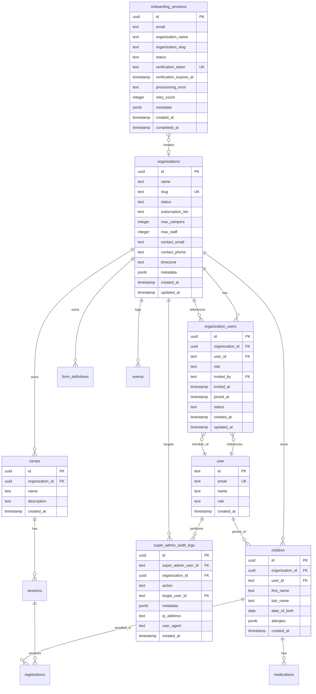

# Multi-Tenant Infrastructure Foundation

**Status**: Planning (Post-Review - Option B)
**Priority**: CRITICAL (Blocks all future development)
**Estimated Effort**: 6-7 weeks full-time (revised from 11 weeks)
**Created**: 2025-12-17
**Last Updated**: 2025-12-17 (Post-review updates applied)

---

## Executive Summary

Transform Camp OS from a single-tenant camp management system into a multi-tenant SaaS platform where:
1. **Camp OS employees** can manage multiple client camps and access their databases
2. **Client databases** are completely isolated from each other
3. **New camps** can self-service onboard and provision their own database
4. **Free tier** available initially (no billing/payment integration)

**Critical Context**: This is not an incremental feature—it's a **fundamental architectural transformation** affecting all 23 database tables, 100+ queries, authentication flows, RBAC system, and every UI component.

**Key Risk**: Data isolation. One missed organizationId filter = data breach. Mitigation: PostgreSQL Row-Level Security (RLS).

---

## 🔴 CRITICAL: Post-Review Updates (Option B)

**Review Completed**: 2025-12-17
**Reviewers**: DHH Rails Reviewer, Kieran Quality Reviewer, Code Simplicity Reviewer
**Decision**: Option B - Fix bugs + keep most features, reduce to 6-7 weeks

### Critical Bug Fixes Required

**BUG #1: RLS Connection Pooling Race Condition** 🔴 BLOCKING
- **Issue**: `SET LOCAL` without transaction causes data leakage with connection pooling
- **Fix**: Wrap all RLS context in `db.transaction()` to hold connection
- **Location**: Phase 2 implementation
- **Severity**: CRITICAL - Data breach risk

**BUG #2: Super Admin Preview Mode Not Enforced** 🔴 BLOCKING
- **Issue**: "Preview As" says read-only but no middleware enforcement
- **Fix**: Add middleware check blocking non-GET requests during preview
- **Location**: Phase 5 implementation
- **Severity**: CRITICAL - Super admins could modify client data

**BUG #3: Onboarding Double-Provisioning Race** 🔴 BLOCKING
- **Issue**: Email verification can trigger provisioning twice
- **Fix**: Atomic status transition `WHERE status = 'pending'`
- **Location**: Phase 4 implementation
- **Severity**: CRITICAL - Duplicate organizations

**BUG #4: Unsafe Migration Script** 🔴 BLOCKING
- **Issue**: No FK validation, wrong table update order
- **Fix**: Parent → child order, dry-run mode, FK validation
- **Location**: Phase 6 implementation
- **Severity**: CRITICAL - Database corruption risk

### Simplifications Applied (Timeline Reduction)

**REMOVED** to reduce complexity:
- ❌ `onboarding_sessions` table - Use simple try/catch instead of state machine
- ❌ `super_admin_audit_logs` table - Use existing `events` table
- ❌ Email verification gate before provisioning - Create org immediately, verify async
- ❌ Retry logic (3 attempts) - Manual intervention on failure

**KEPT** for comprehensive foundation:
- ✅ RLS policies (with transaction wrapper fix)
- ✅ Super admin portal (internal tooling)
- ✅ Team member invitations during onboarding
- ✅ Many-to-many organization_users (future-proofing)

**Timeline Impact**: 11 weeks → 6-7 weeks (35% reduction)

---

## Table of Contents

- [Problem Statement](#problem-statement)
- [Current System Analysis](#current-system-analysis)
- [Proposed Solution](#proposed-solution)
- [Technical Architecture](#technical-architecture)
- [Implementation Phases](#implementation-phases)
- [Critical Questions](#critical-questions)
- [Acceptance Criteria](#acceptance-criteria)
- [Success Metrics](#success-metrics)
- [Risk Analysis](#risk-analysis)
- [References](#references)

---

## Problem Statement

### Current Limitations

**Single-Tenant Architecture**: Camp OS currently assumes all data belongs to one camp operation:
- All 23 tables scoped to individual `userId` with no organization/tenant concept
- Single god-mode `admin` role sees everything
- No way to isolate data between different camp organizations
- No mechanism for Camp OS team to manage multiple clients
- No self-service onboarding for new camps

**Business Impact**:
- Cannot scale to multiple camp clients
- Manual setup required for each new camp
- No visibility for Camp OS employees into client operations
- Data security concerns if expanding beyond single camp

### Stakeholders Affected

1. **Camp OS Employees (New)** - Need admin portal to manage clients
2. **Camp Administrators** - Need isolated tenant environments
3. **Existing Users** - Must migrate to new multi-tenant model
4. **Parents & Staff** - Transparent change (no UX impact ideally)

---

## Current System Analysis

### Database Schema (23 Tables)

**User Management (Better Auth)**:
- `user`, `session`, `account`, `verification` (4 tables)

**Camp Management Core**:
- `children`, `medications`, `camps`, `sessions`, `registrations`, `incidents`, `documents`, `events` (8 tables)

**Organization & Operations**:
- `groups`, `assignments`, `groupMembers`, `attendance`, `medicationLogs` (5 tables)

**AI & Forms**:
- `aiActions`, `formDefinitions`, `formFields`, `formOptions`, `formSnapshots`, `formSubmissions` (6 tables)

**Current Isolation Model**:
- **Parents**: Own their children via `userId`
- **Staff**: Assigned to specific groups via `assignments` table
- **Admin**: Single user with full system access
- **No Organization Concept**: No `organizationId`, `tenantId`, or `clientId` anywhere

### Technology Stack

- **Framework**: Next.js 15.5.9 (App Router, React 19, TypeScript)
- **Database**: PostgreSQL with Drizzle ORM 0.44.4 (postgres.js driver)
- **Auth**: Better Auth 1.3.4 (Google OAuth + Dev Auth)
- **UI**: shadcn/ui + Tailwind CSS v4
- **Forms**: React Hook Form 7.68.0 + Zod 4.2.1
- **AI**: Vercel AI SDK (OpenAI gpt-4o-mini)
- **Rate Limiting**: Vercel KV/Redis

### Existing RBAC System

**Four Roles** (`/Users/smroczek/Projects/camp-os/src/lib/rbac.ts`):
```typescript
parent: child [create,read,update], registration [create,read,cancel]
staff: child [read], registration [read], incident [create,read,update]
nurse: medication [CRUD], medicalRecord [read,update]
admin: Full system access (all resources, all actions)
```

**Permission Enforcement**:
- Server Actions call `enforcePermission(userId, resource, action, resourceId?)`
- Parents: Filtered by `WHERE userId = session.user.id`
- Staff: Filtered via `assignments` table
- Admin: No filtering (god mode)

---

## Proposed Solution

### High-Level Architecture

**Database Isolation Strategy**: Row-Level Security (RLS) with Shared Schema

**Why RLS?**
- ✅ Simplest for MVP (single database, no connection pooling complexity)
- ✅ Native database enforcement (reduces application code risk)
- ✅ Good performance with proper indexes
- ✅ Can migrate to separate databases later if needed
- ❌ Requires setting session variable on every connection
- ❌ More complex RLS policy management

**Alternatives Considered**:
- **Separate Database per Tenant**: Strongest isolation but expensive (10-20MB per tenant × 1000 = 20GB+)
- **Schema-per-Tenant**: Middle ground but PostgreSQL limits ~100-1000 schemas

### Core Components

#### 1. New Database Tables

**`organizations`** - Core tenant entity
```typescript
organizations: {
  id: uuid (PK)
  name: text (e.g., "Pine Ridge Summer Camp")
  slug: text (unique, for subdomain/path routing)
  status: 'active' | 'suspended' | 'trial' | 'inactive'
  databaseSchema: text (e.g., "org_abc123") - reserved for future
  subscriptionTier: 'free' | 'pro' | 'enterprise'
  maxCampers: integer (100 for free tier)
  maxStaff: integer (20 for free tier)
  contactEmail: text
  contactPhone: text
  timezone: text
  metadata: jsonb (flexible config)
  createdAt: timestamp
  updatedAt: timestamp
}
```

**`organization_users`** - Many-to-many user-organization relationship
```typescript
organization_users: {
  id: uuid (PK)
  organizationId: uuid (FK → organizations.id, onDelete: cascade)
  userId: text (FK → user.id, onDelete: cascade)
  role: 'owner' | 'admin' | 'member' (org-level role, separate from app role)
  invitedBy: text (FK → user.id, nullable)
  invitedAt: timestamp
  joinedAt: timestamp
  status: 'invited' | 'active' | 'suspended'
  createdAt: timestamp
  updatedAt: timestamp
}
```

~~**`onboarding_sessions`**~~ - ❌ REMOVED (Simplification)
- **Reason**: State machine complexity not needed for MVP
- **Alternative**: Simple signup form → Create org/user in transaction → Done
- **LOC saved**: ~350 lines

~~**`super_admin_audit_logs`**~~ - ❌ REMOVED (Simplification)
- **Reason**: Redundant with existing `events` table
- **Alternative**: Use `events` table with `type: 'super_admin_action'`
- **LOC saved**: ~150 lines

#### 2. Modified Tables - Add organizationId to ALL Content Tables

**Required Changes** (19 tables):
```typescript
// EVERY content table needs this field
organizationId: uuid("organization_id")
  .references(() => organizations.id, { onDelete: "cascade" })
  .notNull()

// EVERY table needs this composite index (critical for query performance)
index("tablename_org_idx").on(table.organizationId)
// Add organizationId to existing indexes, e.g.:
index("children_org_user_idx").on(table.organizationId, table.userId)
```

**Tables to Modify**:
1. `children` - add organizationId + composite index (organizationId, userId)
2. `medications` - add organizationId
3. `camps` - add organizationId (camps belong to organizations)
4. `sessions` - add organizationId (via camps)
5. `registrations` - add organizationId
6. `incidents` - add organizationId
7. `documents` - add organizationId
8. `events` - add organizationId (audit logs scoped to org)
9. `groups` - add organizationId
10. `assignments` - add organizationId
11. `groupMembers` - add organizationId
12. `attendance` - add organizationId
13. `medicationLogs` - add organizationId
14. `aiActions` - add organizationId
15. `formDefinitions` - add organizationId
16. `formFields` - add organizationId (via formDefinitions)
17. `formOptions` - add organizationId (via formDefinitions)
18. `formSnapshots` - add organizationId
19. `formSubmissions` - add organizationId

**Tables NOT Modified** (Auth & Cross-Org):
- `user` (users can belong to multiple orgs via `organization_users`)
- `session`, `account`, `verification` (Better Auth tables)
- `super_admin_audit_logs` (tracks cross-org actions)
- `onboarding_sessions` (pre-organization state)

#### 3. PostgreSQL Row-Level Security Policies

**Enable RLS on All Content Tables**:
```sql
-- Example for children table
ALTER TABLE children ENABLE ROW LEVEL SECURITY;

CREATE POLICY children_org_isolation ON children
  FOR ALL
  USING (organization_id = current_setting('app.current_organization_id')::uuid)
  WITH CHECK (organization_id = current_setting('app.current_organization_id')::uuid);

-- Bypass RLS for super-admins (optional, use carefully)
CREATE POLICY children_super_admin_bypass ON children
  FOR ALL
  TO super_admin_role
  USING (true);
```

**Set Organization Context on Every Request** (🔴 BUG #1 FIX APPLIED):
```typescript
// lib/db/tenant-context.ts
import { db } from '@/lib/db';
import { sql } from 'drizzle-orm';

// ✅ FIX: Wrap in transaction to hold connection (prevents pooling race condition)
export async function withOrganizationContext<T>(
  organizationId: string,
  callback: (tx: Transaction) => Promise<T>
): Promise<T> {
  return db.transaction(async (tx) => {
    // Set PostgreSQL session variable for RLS within transaction scope
    await tx.execute(
      sql`SET LOCAL app.current_organization_id = ${organizationId}`
    );

    // Pass transaction to callback to ensure same connection is used
    return await callback(tx);
  });
}

// Usage in Server Action (updated to use transaction parameter)
export async function getChildrenAction() {
  const session = await getSession();
  const organizationId = session.user.activeOrganizationId;

  // ✅ Pass transaction (tx) to callback and use it for queries
  return withOrganizationContext(organizationId, async (tx) => {
    // All queries now automatically filtered by RLS + use same connection
    return tx.query.children.findMany();
  });
}
```

---

## Technical Architecture

### Multi-Tenancy Strategy

**Session Management**:
```typescript
// Extend Better Auth user session
interface UserSession {
  user: {
    id: string;
    email: string;
    role: 'parent' | 'staff' | 'admin' | 'nurse' | 'super_admin'; // Add super_admin
    activeOrganizationId: string | null; // NEW: Current tenant context
    organizations: Array<{ // NEW: User's org memberships
      id: string;
      name: string;
      slug: string;
      role: 'owner' | 'admin' | 'member';
    }>;
  };
}
```

**Middleware Flow** (`src/middleware.ts`):
```typescript
export async function middleware(req: NextRequest) {
  const session = await getSession();

  // 1. Extract tenant from subdomain/path/header
  const host = req.headers.get('host') || '';
  const subdomain = host.split('.')[0]; // e.g., "pine-ridge"

  // 2. Look up organization by subdomain
  const org = await getOrganizationBySlug(subdomain);

  if (!org && !isPublicRoute(req.nextUrl.pathname)) {
    return NextResponse.redirect(new URL('/404', req.url));
  }

  // 3. Verify user has access to this organization
  if (session && org) {
    const hasAccess = await userBelongsToOrganization(session.user.id, org.id);
    if (!hasAccess && session.user.role !== 'super_admin') {
      return NextResponse.redirect(new URL('/unauthorized', req.url));
    }
  }

  // 4. Inject organization context into request headers
  const requestHeaders = new Headers(req.headers);
  requestHeaders.set('x-organization-id', org?.id || '');

  return NextResponse.next({
    request: { headers: requestHeaders },
  });
}

export const config = {
  matcher: ['/dashboard/:path*', '/api/:path*'],
};
```

**Query Filtering Helper** (`lib/db/org-db.ts`):
```typescript
import { headers } from 'next/headers';
import { db } from '@/lib/db';
import { sql } from 'drizzle-orm';

/**
 * Get organization-scoped database connection
 * Automatically sets RLS context
 */
export async function getOrgDb() {
  const headersList = headers();
  const organizationId = headersList.get('x-organization-id');

  if (!organizationId) {
    throw new Error('Organization context not set');
  }

  // Set RLS context for this connection
  await db.execute(
    sql`SET LOCAL app.current_organization_id = ${organizationId}`
  );

  return db;
}

// Usage in Server Action
export async function addChildAction(data: AddChildInput) {
  const orgDb = await getOrgDb(); // Auto-scoped to current org
  const session = await getSession();

  enforcePermission(session.user.id, 'child', 'create');

  // RLS automatically filters by organizationId
  const [child] = await orgDb.insert(children).values({
    organizationId: session.user.activeOrganizationId,
    userId: session.user.id,
    ...data,
  }).returning();

  return child;
}
```

### User Flows

#### Flow 1: New Camp Onboarding (Self-Service)

**Page: `/signup`**
```typescript
// app/(public)/signup/page.tsx
<OnboardingForm>
  Step 1: Organization Details
    - Organization name (required)
    - Auto-generate slug from name
    - Contact email (required)
    - Contact phone
    - Timezone (dropdown, default to browser)

  Step 2: Admin Account Creation
    - First name, last name
    - Email (will be verified)
    - Password (min 8 chars, complexity rules)
    - Confirm password

  Step 3: Review & Submit
    - Show summary
    - Terms of service checkbox
    - Submit button → POST /api/onboarding
</OnboardingForm>
```

**API: `POST /api/onboarding`** (✅ SIMPLIFIED - No state machine)
```typescript
// app/api/onboarding/route.ts
export async function POST(req: Request) {
  const body = await req.json();

  // 1. Validate input with Zod
  const data = onboardingSchema.parse(body);

  // 2. Check for duplicate organization slug
  const existing = await db.query.organizations.findFirst({
    where: eq(organizations.slug, data.organizationSlug),
  });
  if (existing) {
    return NextResponse.json({ error: 'Organization already exists' }, { status: 409 });
  }

  try {
    // 3. Create org + admin + team members in ONE transaction
    await provisionOrganization(data);

    // 4. Send welcome email (async, don't block)
    sendWelcomeEmail(data.email, data.organizationName).catch(console.error);

    // 5. Return success immediately
    return NextResponse.json({
      success: true,
      message: 'Organization created! Redirecting to dashboard...',
      redirectUrl: `/org/${data.organizationSlug}/dashboard`,
    });
  } catch (error) {
    // Simple error handling - no retry logic
    console.error('Provisioning failed:', error);

    // Notify Camp OS team (async)
    notifyTeamOfProvisioningFailure(data, error).catch(console.error);

    return NextResponse.json({
      error: 'Failed to create organization. Please try again or contact support.',
      details: error.message,
    }, { status: 500 });
  }
}
```

~~**Page: `/verify-email?token=xxx`**~~ - ❌ REMOVED (Email verification moved to post-signup)

**Email Verification** (async, after signup):
- User creates organization → gets immediate access
- Welcome email includes verification link
- Unverified users see banner in dashboard: "Please verify your email"
- Can still use all features (trust-by-default for free tier)

**Provisioning Function** (`lib/provisioning/provision-organization.ts`) - ✅ SIMPLIFIED
```typescript
export async function provisionOrganization(data: OnboardingInput) {
  // Single transaction: Create organization + admin user + membership
  return db.transaction(async (tx) => {
    // 1. Create organization
    const [org] = await tx.insert(organizations).values({
      name: data.organizationName,
      slug: data.organizationSlug,
      status: 'active',
      subscriptionTier: 'free',
      maxCampers: 100,
      maxStaff: 20,
      contactEmail: data.email,
      timezone: data.timezone || 'America/New_York',
    }).returning();

    // 2. Create admin user account (Better Auth)
    // NOTE: This is outside transaction scope - potential failure point
    // If this fails, transaction will rollback automatically
    const { data: authData } = await auth.api.signUpEmail({
      body: {
        email: data.email,
        password: data.password,
        name: `${data.firstName} ${data.lastName}`,
      },
    });

    // 3. Update user role to admin
    await tx.update(user)
      .set({ role: 'admin' })
      .where(eq(user.id, authData.user.id));

    // 4. Create organization membership
    await tx.insert(organizationUsers).values({
      organizationId: org.id,
      userId: authData.user.id,
      role: 'owner',
      status: 'active',
      joinedAt: new Date(),
    });

    // 5. (Optional) Add team members if provided
    if (data.teamMembers?.length > 0) {
      for (const member of data.teamMembers) {
        // Send invitation emails (handle outside transaction)
        await sendTeamInvitation({
          email: member.email,
          organizationId: org.id,
          role: member.role,
          invitedBy: authData.user.id,
        });
      }
    }

    // 6. Create audit log
    await tx.insert(events).values({
      type: 'organization_created',
      userId: authData.user.id,
      organizationId: org.id,
      metadata: {
        source: 'self_service_onboarding',
        subscriptionTier: 'free',
        teamMembersInvited: data.teamMembers?.length || 0,
      },
    });

    return { organizationId: org.id, userId: authData.user.id };
  });
}
```

#### Flow 2: Camp OS Employee Management Portal

**Page: `/super-admin/dashboard`**
```typescript
// app/(super-admin)/super-admin/dashboard/page.tsx
export default async function SuperAdminDashboard() {
  const session = await getSession();

  if (session?.user?.role !== 'super_admin') {
    redirect('/unauthorized');
  }

  // Get all organizations with stats
  const organizations = await db.query.organizations.findMany({
    with: {
      _count: {
        users: true,
        camps: true,
        children: true,
      },
    },
    orderBy: (orgs, { desc }) => [desc(orgs.createdAt)],
  });

  return (
    <SuperAdminLayout>
      <h1>Camp OS Admin Portal</h1>

      <StatsCards>
        <Card>Total Organizations: {organizations.length}</Card>
        <Card>Active: {organizations.filter(o => o.status === 'active').length}</Card>
        <Card>Trial: {organizations.filter(o => o.status === 'trial').length}</Card>
      </StatsCards>

      <OrganizationTable organizations={organizations}>
        {/* Each row has: Name, Status, Users, Camps, Children, Created Date, Actions */}
        <TableRow>
          <TableCell>{org.name}</TableCell>
          <TableCell><StatusBadge status={org.status} /></TableCell>
          <TableCell>{org._count.users}</TableCell>
          <TableCell>{org._count.camps}</TableCell>
          <TableCell>{org._count.children}</TableCell>
          <TableCell>{formatDate(org.createdAt)}</TableCell>
          <TableCell>
            <DropdownMenu>
              <DropdownMenuItem>
                <Link href={`/super-admin/organizations/${org.id}`}>
                  View Details
                </Link>
              </DropdownMenuItem>
              <DropdownMenuItem>
                <Button onClick={() => impersonateOrg(org.id)}>
                  Impersonate (Read-Only)
                </Button>
              </DropdownMenuItem>
              <DropdownMenuItem className="text-destructive">
                <Button onClick={() => suspendOrg(org.id)}>
                  Suspend
                </Button>
              </DropdownMenuItem>
            </DropdownMenu>
          </TableCell>
        </TableRow>
      </OrganizationTable>
    </SuperAdminLayout>
  );
}
```

**Impersonation Flow**:
```typescript
// app/actions/super-admin-actions.ts
"use server";

export async function impersonateOrganizationAction(organizationId: string) {
  const session = await getSession();

  if (session?.user?.role !== 'super_admin') {
    throw new Error('Unauthorized');
  }

  // Create audit log
  await db.insert(superAdminAuditLogs).values({
    superAdminUserId: session.user.id,
    organizationId,
    action: 'impersonate_start',
    metadata: { reason: 'Support request' },
    ipAddress: headers().get('x-forwarded-for'),
    userAgent: headers().get('user-agent'),
  });

  // Create temporary impersonation token (1 hour expiry)
  const impersonationToken = await createImpersonationToken({
    superAdminUserId: session.user.id,
    organizationId,
    expiresAt: addHours(new Date(), 1),
  });

  // Redirect to organization dashboard with token
  redirect(`/organizations/${organizationId}/dashboard?impersonate=${impersonationToken}`);
}
```

#### Flow 3: Organization Switcher (Multi-Org Users)

**Component: `<OrganizationSwitcher />`**
```typescript
// components/organization-switcher.tsx
"use client";

export function OrganizationSwitcher({ currentOrgId, organizations }: Props) {
  const [isOpen, setIsOpen] = useState(false);

  const handleSwitch = async (orgId: string) => {
    // Call server action to update active organization in session
    await switchOrganizationAction(orgId);

    // Redirect to new org dashboard
    const newOrg = organizations.find(o => o.id === orgId);
    window.location.href = `https://${newOrg.slug}.${process.env.NEXT_PUBLIC_DOMAIN}/dashboard`;
  };

  return (
    <DropdownMenu open={isOpen} onOpenChange={setIsOpen}>
      <DropdownMenuTrigger asChild>
        <Button variant="outline">
          {organizations.find(o => o.id === currentOrgId)?.name}
          <ChevronDown className="ml-2 h-4 w-4" />
        </Button>
      </DropdownMenuTrigger>
      <DropdownMenuContent align="end" className="w-[300px]">
        <DropdownMenuLabel>Switch Organization</DropdownMenuLabel>
        <DropdownMenuSeparator />
        {organizations.map((org) => (
          <DropdownMenuItem
            key={org.id}
            onClick={() => handleSwitch(org.id)}
            className={cn(currentOrgId === org.id && "bg-accent")}
          >
            <Building2 className="mr-2 h-4 w-4" />
            <div className="flex flex-col">
              <span className="font-medium">{org.name}</span>
              <span className="text-xs text-muted-foreground">{org.role}</span>
            </div>
            {currentOrgId === org.id && (
              <Check className="ml-auto h-4 w-4" />
            )}
          </DropdownMenuItem>
        ))}
        <DropdownMenuSeparator />
        <DropdownMenuItem onClick={() => window.location.href = '/organizations/new'}>
          <Plus className="mr-2 h-4 w-4" />
          Create New Organization
        </DropdownMenuItem>
      </DropdownMenuContent>
    </DropdownMenu>
  );
}
```

---

## Implementation Phases

### Phase 1: Database Schema Foundation (Week 1-2)

**Objective**: Create new tables and add organizationId to existing tables

**Tasks**:
1. **Schema Design** (`src/lib/schema.ts`)
   - [ ] Create `organizations` table with all fields
   - [ ] Create `organization_users` table (many-to-many)
   - [ ] Create `onboarding_sessions` table
   - [ ] Create `super_admin_audit_logs` table
   - [ ] Add `super_admin` to user.role enum

2. **Schema Migration** - Add organizationId to ALL content tables
   - [ ] Add `organizationId` field to `children` table
   - [ ] Add `organizationId` field to `medications` table
   - [ ] Add `organizationId` field to `camps` table
   - [ ] Add `organizationId` field to `sessions` table
   - [ ] Add `organizationId` field to `registrations` table
   - [ ] Add `organizationId` field to `incidents` table
   - [ ] Add `organizationId` field to `documents` table
   - [ ] Add `organizationId` field to `events` table
   - [ ] Add `organizationId` field to `groups` table
   - [ ] Add `organizationId` field to `assignments` table
   - [ ] Add `organizationId` field to `groupMembers` table
   - [ ] Add `organizationId` field to `attendance` table
   - [ ] Add `organizationId` field to `medicationLogs` table
   - [ ] Add `organizationId` field to `aiActions` table
   - [ ] Add `organizationId` field to `formDefinitions` table
   - [ ] Add `organizationId` field to `formFields` table (via formDefinitions FK)
   - [ ] Add `organizationId` field to `formOptions` table (via formDefinitions FK)
   - [ ] Add `organizationId` field to `formSnapshots` table
   - [ ] Add `organizationId` field to `formSubmissions` table

3. **Indexing Strategy**
   - [ ] Create composite index `(organizationId, userId)` on `children`
   - [ ] Create composite index `(organizationId, campId)` on `sessions`
   - [ ] Create composite index `(organizationId, sessionId)` on `registrations`
   - [ ] Create composite index `(organizationId, status)` on `registrations`
   - [ ] Create composite index `(organizationId, date)` on `attendance`
   - [ ] Create single index on `organizationId` for all other tables

4. **Migration Scripts**
   - [ ] Run `npm run db:generate` to create migration SQL
   - [ ] Review migration SQL for safety (no data loss)
   - [ ] Test migration on copy of production data
   - [ ] Create rollback migration script

**Deliverables**:
- `/Users/smroczek/Projects/camp-os/src/lib/schema.ts` updated with new tables and organizationId fields
- `/Users/smroczek/Projects/camp-os/drizzle/` migration files
- Migration test results document

**Testing**:
```typescript
// Test all tables have organizationId
const tables = await db.execute(sql`
  SELECT table_name
  FROM information_schema.columns
  WHERE column_name = 'organization_id'
  AND table_schema = 'public'
`);
console.log('Tables with organizationId:', tables.rows.length); // Should be 19
```

**Example Files**:

`src/lib/schema/organizations.ts`
```typescript
import { pgTable, uuid, text, integer, timestamp, jsonb, index } from "drizzle-orm/pg-core";

export const organizations = pgTable("organizations", {
  id: uuid("id").defaultRandom().primaryKey(),
  name: text("name").notNull(),
  slug: text("slug").notNull().unique(), // For subdomain routing
  status: text("status").notNull().default("active"), // active, suspended, trial, inactive
  subscriptionTier: text("subscription_tier").notNull().default("free"), // free, pro, enterprise
  maxCampers: integer("max_campers").default(100),
  maxStaff: integer("max_staff").default(20),
  contactEmail: text("contact_email").notNull(),
  contactPhone: text("contact_phone"),
  timezone: text("timezone").default("America/New_York"),
  metadata: jsonb("metadata").$type<Record<string, any>>().default({}),
  createdAt: timestamp("created_at", { withTimezone: true }).defaultNow().notNull(),
  updatedAt: timestamp("updated_at", { withTimezone: true }).defaultNow().notNull(),
}, (table) => ({
  slugIdx: index("organizations_slug_idx").on(table.slug),
  statusIdx: index("organizations_status_idx").on(table.status),
}));

export const organizationUsers = pgTable("organization_users", {
  id: uuid("id").defaultRandom().primaryKey(),
  organizationId: uuid("organization_id").references(() => organizations.id, { onDelete: "cascade" }).notNull(),
  userId: text("user_id").references(() => user.id, { onDelete: "cascade" }).notNull(),
  role: text("role").notNull().default("member"), // owner, admin, member
  invitedBy: text("invited_by").references(() => user.id),
  invitedAt: timestamp("invited_at", { withTimezone: true }),
  joinedAt: timestamp("joined_at", { withTimezone: true }),
  status: text("status").notNull().default("active"), // invited, active, suspended
  createdAt: timestamp("created_at", { withTimezone: true }).defaultNow().notNull(),
  updatedAt: timestamp("updated_at", { withTimezone: true }).defaultNow().notNull(),
}, (table) => ({
  orgUserIdx: index("organization_users_org_user_idx").on(table.organizationId, table.userId),
  userIdx: index("organization_users_user_idx").on(table.userId),
}));
```

---

### Phase 2: Row-Level Security Implementation (Week 2-3)

**Objective**: Implement database-level tenant isolation via PostgreSQL RLS

**Tasks**:
1. **RLS Policy Creation** (`db/migrations/` + manual SQL)
   - [ ] Create migration file for RLS policies
   - [ ] Write `ALTER TABLE ... ENABLE ROW LEVEL SECURITY` for all 19 content tables
   - [ ] Create `org_isolation` policy for each table using `current_setting('app.current_organization_id')`
   - [ ] Create `super_admin_bypass` policy (optional, use with extreme caution)
   - [ ] Test policies with multiple organizations

2. **Database Context Helper** (`src/lib/db/tenant-context.ts`)
   - [ ] Create `withOrganizationContext(orgId, callback)` wrapper function
   - [ ] Implement `SET LOCAL app.current_organization_id` execution
   - [ ] Add error handling for missing organization context
   - [ ] Create `getOrgDb()` helper for Server Actions

3. **Middleware Integration** (`src/middleware.ts`)
   - [ ] Extract organization from subdomain/path/header
   - [ ] Look up organization by slug
   - [ ] Verify user has access to organization
   - [ ] Inject `x-organization-id` header into request

4. **Session Enhancement** (`src/lib/auth.ts`)
   - [ ] Add `activeOrganizationId` to Better Auth session
   - [ ] Add `organizations` array to session (user's memberships)
   - [ ] Create `switchOrganizationAction` server action
   - [ ] Update session on organization switch

**Deliverables**:
- `/Users/smroczek/Projects/camp-os/src/lib/db/tenant-context.ts`
- `/Users/smroczek/Projects/camp-os/src/middleware.ts` updated
- `/Users/smroczek/Projects/camp-os/src/lib/auth.ts` updated with session fields
- RLS policy migration SQL files

**Testing**:
```typescript
// Test RLS enforcement
const org1User = await createTestUser({ organizationId: 'org-1' });
const org2User = await createTestUser({ organizationId: 'org-2' });

await withOrganizationContext('org-1', async () => {
  const children = await db.query.children.findMany();
  expect(children).toHaveLength(2); // Only org-1's children
});

await withOrganizationContext('org-2', async () => {
  const children = await db.query.children.findMany();
  expect(children).toHaveLength(3); // Only org-2's children
});

// Test cross-org data leakage (should fail)
await withOrganizationContext('org-1', async () => {
  const org2Child = await db.query.children.findFirst({
    where: eq(children.id, org2ChildId),
  });
  expect(org2Child).toBeNull(); // RLS blocks access
});
```

**Example Files**:

`src/lib/db/tenant-context.ts`
```typescript
import { db } from '@/lib/db';
import { sql } from 'drizzle-orm';
import { headers } from 'next/headers';

export async function withOrganizationContext<T>(
  organizationId: string,
  callback: () => Promise<T>
): Promise<T> {
  if (!organizationId) {
    throw new Error('Organization ID is required for tenant context');
  }

  // Set PostgreSQL session variable for RLS policies
  await db.execute(
    sql`SET LOCAL app.current_organization_id = ${organizationId}`
  );

  try {
    return await callback();
  } finally {
    // Reset context (optional, connection pooling will handle)
    await db.execute(sql`RESET app.current_organization_id`);
  }
}

export async function getOrgDb() {
  const headersList = headers();
  const organizationId = headersList.get('x-organization-id');

  if (!organizationId) {
    throw new Error('Organization context not found in request headers');
  }

  await db.execute(
    sql`SET LOCAL app.current_organization_id = ${organizationId}`
  );

  return db;
}

export async function getOrganizationFromRequest(): Promise<string> {
  const headersList = headers();
  const organizationId = headersList.get('x-organization-id');

  if (!organizationId) {
    throw new Error('Organization context not found in request headers');
  }

  return organizationId;
}
```

`db/migrations/0002_enable_rls.sql`
```sql
-- Enable Row-Level Security on all content tables

-- Children table
ALTER TABLE children ENABLE ROW LEVEL SECURITY;

CREATE POLICY children_org_isolation ON children
  FOR ALL
  USING (organization_id = current_setting('app.current_organization_id')::uuid)
  WITH CHECK (organization_id = current_setting('app.current_organization_id')::uuid);

-- Medications table
ALTER TABLE medications ENABLE ROW LEVEL SECURITY;

CREATE POLICY medications_org_isolation ON medications
  FOR ALL
  USING (organization_id = current_setting('app.current_organization_id')::uuid)
  WITH CHECK (organization_id = current_setting('app.current_organization_id')::uuid);

-- Camps table
ALTER TABLE camps ENABLE ROW LEVEL SECURITY;

CREATE POLICY camps_org_isolation ON camps
  FOR ALL
  USING (organization_id = current_setting('app.current_organization_id')::uuid)
  WITH CHECK (organization_id = current_setting('app.current_organization_id')::uuid);

-- Repeat for all 19 content tables...

-- Super admin bypass (optional - use with caution)
-- CREATE ROLE super_admin_role;
--
-- CREATE POLICY children_super_admin_bypass ON children
--   FOR ALL
--   TO super_admin_role
--   USING (true);
--
-- Repeat for all tables...
```

---

### Phase 3: Query Rewrite & Service Layer Updates (Week 3-5)

**Objective**: Update all database queries to be organization-aware

**Tasks**:
1. **Query Audit** - Identify all database queries
   - [ ] Run `grep -r "db.query" src/` to find all Drizzle queries
   - [ ] Run `grep -r "db.select" src/` to find all raw queries
   - [ ] Run `grep -r "db.insert" src/` to find all inserts
   - [ ] Run `grep -r "db.update" src/` to find all updates
   - [ ] Run `grep -r "db.delete" src/` to find all deletes
   - [ ] Create spreadsheet tracking 100+ queries and their update status

2. **Server Actions Update** (`src/app/actions/`)
   - [ ] Update `parent-actions.ts` - Add organizationId to all queries
   - [ ] Update `form-actions.ts` - Add organizationId to form submissions
   - [ ] Create new `organization-actions.ts` for org management
   - [ ] Update all actions to use `getOrgDb()` helper

3. **Service Layer Update** (`src/services/`)
   - [ ] Update `RegistrationService` - Accept organizationId parameter
   - [ ] Update `FormService` - Accept organizationId parameter
   - [ ] Create `OrganizationService` - CRUD for organizations
   - [ ] Create `ProvisioningService` - Tenant provisioning logic

4. **API Routes Update** (`src/app/api/`)
   - [ ] Update `camps/route.ts` - Filter by organizationId
   - [ ] Update `chat/route.ts` - Scope AI context to organization
   - [ ] Create `onboarding/route.ts` - Handle signup flow
   - [ ] Update all API routes to extract organizationId from headers

5. **Dashboard Pages Update** (`src/app/dashboard/`)
   - [ ] Update `parent/page.tsx` - Filter children by organizationId
   - [ ] Update `staff/page.tsx` - Filter groups by organizationId
   - [ ] Update `admin/page.tsx` - Scope all queries to organization
   - [ ] Update `admin/forms/page.tsx` - Organization-specific forms

**Deliverables**:
- All 100+ database queries updated with organizationId filtering
- All services accept and use organizationId parameter
- Query audit spreadsheet with completion status

**Testing**:
```typescript
// E2E test: Multi-tenant isolation
describe('Multi-tenant data isolation', () => {
  it('prevents cross-organization data access', async () => {
    // Setup: Create two organizations with data
    const org1 = await createOrganization({ name: 'Org 1' });
    const org2 = await createOrganization({ name: 'Org 2' });

    const org1Child = await createChild({ organizationId: org1.id, name: 'Alice' });
    const org2Child = await createChild({ organizationId: org2.id, name: 'Bob' });

    // Test: Org 1 user cannot see Org 2 data
    const org1User = await loginAsUser({ organizationId: org1.id, role: 'parent' });
    const children = await org1User.getChildren();

    expect(children).toHaveLength(1);
    expect(children[0].name).toBe('Alice');
    expect(children.some(c => c.name === 'Bob')).toBe(false);
  });

  it('allows super-admin to access all organizations', async () => {
    const superAdmin = await loginAsUser({ role: 'super_admin' });
    const organizations = await superAdmin.listOrganizations();

    expect(organizations.length).toBeGreaterThan(1);
  });
});
```

**Example Query Updates**:

**Before** (`src/app/actions/parent-actions.ts`):
```typescript
export async function getChildrenAction() {
  const session = await getSession();

  return db.query.children.findMany({
    where: eq(children.userId, session.user.id),
  });
}
```

**After**:
```typescript
export async function getChildrenAction() {
  const session = await getSession();
  const orgDb = await getOrgDb(); // Auto-scoped to organization

  // RLS automatically filters by organizationId, but explicit filter is good practice
  return orgDb.query.children.findMany({
    where: and(
      eq(children.organizationId, session.user.activeOrganizationId),
      eq(children.userId, session.user.id)
    ),
  });
}
```

---

### Phase 4: Self-Service Onboarding Flow (Week 4-5)

**Objective**: Build public signup flow for new camps

**Tasks**:
1. **Onboarding Pages** (`src/app/(public)/`)
   - [ ] Create `/signup` page with multi-step form
   - [ ] Create `/verify-email` page with token verification
   - [ ] Create `/onboarding/complete` success page
   - [ ] Create `/onboarding/error` failure page with retry

2. **Onboarding Form** (`src/components/onboarding/`)
   - [ ] Create `<OnboardingForm>` with React Hook Form + Zod
   - [ ] Step 1: Organization details (name, slug, contact)
   - [ ] Step 2: Admin account (first name, last name, email, password)
   - [ ] Step 3: Review & submit
   - [ ] Add progress indicator component

3. **API Implementation** (`src/app/api/onboarding/`)
   - [ ] `POST /api/onboarding` - Create onboarding session
   - [ ] `POST /api/onboarding/verify` - Verify email token
   - [ ] `GET /api/onboarding/status/:id` - Check provisioning status (polling)
   - [ ] `POST /api/onboarding/retry/:id` - Retry failed provisioning

4. **Provisioning Service** (`src/lib/provisioning/`)
   - [ ] Create `provisionTenant(sessionId)` function
   - [ ] Implement transaction: Create org → Create user → Create membership
   - [ ] Add error handling and rollback logic
   - [ ] Add retry mechanism (max 3 attempts)
   - [ ] Implement cleanup job for abandoned sessions (7-day expiry)

5. **Email Templates** (`src/lib/email/templates/`)
   - [ ] Create `onboarding-verification.tsx` email template
   - [ ] Create `welcome.tsx` email template
   - [ ] Create `onboarding-failed.tsx` email template
   - [ ] Configure email service (Resend/SendGrid)

**Deliverables**:
- `/Users/smroczek/Projects/camp-os/src/app/(public)/signup/page.tsx`
- `/Users/smroczek/Projects/camp-os/src/app/(public)/verify-email/page.tsx`
- `/Users/smroczek/Projects/camp-os/src/lib/provisioning/provision-tenant.ts`
- `/Users/smroczek/Projects/camp-os/src/app/api/onboarding/route.ts`
- Email templates

**Testing**:
```typescript
// E2E test: Complete onboarding flow
describe('Self-service onboarding', () => {
  it('completes full onboarding flow', async () => {
    // Step 1: Submit signup form
    const response = await fetch('/api/onboarding', {
      method: 'POST',
      body: JSON.stringify({
        organizationName: 'Test Camp',
        email: 'admin@testcamp.com',
        password: 'SecurePass123!',
        firstName: 'John',
        lastName: 'Doe',
      }),
    });

    expect(response.status).toBe(200);
    const { success } = await response.json();
    expect(success).toBe(true);

    // Step 2: Verify email
    const verificationToken = await getVerificationToken('admin@testcamp.com');
    const verifyResponse = await fetch(`/verify-email?token=${verificationToken}`);
    expect(verifyResponse.status).toBe(200);

    // Step 3: Wait for provisioning (poll status)
    const sessionId = await getOnboardingSessionId('admin@testcamp.com');
    let provisioned = false;
    for (let i = 0; i < 10; i++) {
      const status = await fetch(`/api/onboarding/status/${sessionId}`);
      const { state } = await status.json();
      if (state === 'completed') {
        provisioned = true;
        break;
      }
      await sleep(1000);
    }

    expect(provisioned).toBe(true);

    // Step 4: Verify organization exists
    const org = await db.query.organizations.findFirst({
      where: eq(organizations.slug, 'test-camp'),
    });

    expect(org).toBeDefined();
    expect(org.name).toBe('Test Camp');

    // Step 5: Verify admin user can log in
    const loginResponse = await signIn({
      email: 'admin@testcamp.com',
      password: 'SecurePass123!',
    });

    expect(loginResponse.success).toBe(true);
    expect(loginResponse.user.activeOrganizationId).toBe(org.id);
  });

  it('handles provisioning failure gracefully', async () => {
    // Mock database failure
    jest.spyOn(db, 'transaction').mockRejectedValue(new Error('Connection timeout'));

    const response = await fetch('/api/onboarding', {
      method: 'POST',
      body: JSON.stringify({
        organizationName: 'Fail Camp',
        email: 'fail@camp.com',
        password: 'password',
      }),
    });

    // Should still return success (email sent)
    expect(response.status).toBe(200);

    // Verify email and trigger provisioning
    const token = await getVerificationToken('fail@camp.com');
    await fetch(`/verify-email?token=${token}`);

    // Wait for provisioning to fail
    await sleep(2000);

    // Check onboarding session status
    const sessionId = await getOnboardingSessionId('fail@camp.com');
    const session = await db.query.onboardingSessions.findFirst({
      where: eq(onboardingSessions.id, sessionId),
    });

    expect(session.status).toBe('failed');
    expect(session.provisioningError).toBeDefined();
    expect(session.retryCount).toBe(1);

    // Test retry
    const retryResponse = await fetch(`/api/onboarding/retry/${sessionId}`, {
      method: 'POST',
    });

    expect(retryResponse.status).toBe(200);
  });
});
```

---

### Phase 5: Camp OS Employee Portal (Week 5-6)

**Objective**: Build super-admin portal for Camp OS team

**Tasks**:
1. **Super Admin Routes** (`src/app/(super-admin)/`)
   - [ ] Create `/super-admin/dashboard` - Organization list
   - [ ] Create `/super-admin/organizations/[id]` - Organization details
   - [ ] Create `/super-admin/users` - Cross-org user management
   - [ ] Create `/super-admin/audit-logs` - Activity logs
   - [ ] Add authentication guard (super_admin role only)

2. **Organization Management** (`src/app/(super-admin)/organizations/`)
   - [ ] Organization list table with filters (status, tier, created date)
   - [ ] Organization details page (stats, users, camps, recent activity)
   - [ ] Suspend/activate organization action
   - [ ] Manual organization creation form (for pre-onboarding)
   - [ ] Organization settings editor (max campers, max staff, tier)

3. **Impersonation Feature** (`src/app/actions/super-admin-actions.ts`)
   - [ ] Create `impersonateOrganizationAction(orgId)` - Generate impersonation token
   - [ ] Create `endImpersonationAction()` - Return to super-admin portal
   - [ ] Add audit logging for impersonation start/end
   - [ ] Add time limit (1 hour auto-expire)
   - [ ] Show impersonation banner in UI

4. **Audit Logging UI** (`src/app/(super-admin)/audit-logs/`)
   - [ ] Audit log table with filters (user, org, action, date)
   - [ ] Search by organization name, user email, action type
   - [ ] Export audit logs to CSV
   - [ ] Retention policy indicator (show data age)

5. **Statistics Dashboard** (`src/app/(super-admin)/dashboard/`)
   - [ ] Total organizations card (active/trial/suspended breakdown)
   - [ ] Total users across all organizations
   - [ ] Recent onboardings (last 7 days)
   - [ ] Failed provisioning attempts (alert if > threshold)
   - [ ] Revenue projection (if free tier limits are near)

**Deliverables**:
- `/Users/smroczek/Projects/camp-os/src/app/(super-admin)/` route group
- `/Users/smroczek/Projects/camp-os/src/components/super-admin/` UI components
- `/Users/smroczek/Projects/camp-os/src/app/actions/super-admin-actions.ts`
- Super-admin authentication middleware

**Testing**:
```typescript
// E2E test: Super-admin portal
describe('Super-admin portal', () => {
  it('allows super-admin to view all organizations', async () => {
    const superAdmin = await loginAsUser({ role: 'super_admin' });

    const page = await superAdmin.visit('/super-admin/dashboard');
    const organizations = await page.$$eval('table tbody tr', rows => rows.length);

    expect(organizations).toBeGreaterThan(0);
  });

  it('blocks non-super-admin users', async () => {
    const regularAdmin = await loginAsUser({ role: 'admin', organizationId: 'org-1' });

    const response = await regularAdmin.visit('/super-admin/dashboard');

    expect(response.status).toBe(403);
    expect(response.url).toContain('/unauthorized');
  });

  it('logs impersonation actions', async () => {
    const superAdmin = await loginAsUser({ role: 'super_admin' });

    // Start impersonation
    await superAdmin.impersonateOrganization('org-1');

    // Check audit log
    const auditLog = await db.query.superAdminAuditLogs.findFirst({
      where: and(
        eq(superAdminAuditLogs.superAdminUserId, superAdmin.id),
        eq(superAdminAuditLogs.action, 'impersonate_start')
      ),
      orderBy: (logs, { desc }) => [desc(logs.createdAt)],
    });

    expect(auditLog).toBeDefined();
    expect(auditLog.organizationId).toBe('org-1');

    // End impersonation
    await superAdmin.endImpersonation();

    // Check end log
    const endLog = await db.query.superAdminAuditLogs.findFirst({
      where: and(
        eq(superAdminAuditLogs.superAdminUserId, superAdmin.id),
        eq(superAdminAuditLogs.action, 'impersonate_end')
      ),
      orderBy: (logs, { desc }) => [desc(logs.createdAt)],
    });

    expect(endLog).toBeDefined();
  });
});
```

---

### Phase 6: Migration & Rollout (Week 6-7)

**Objective**: Migrate existing data and deploy to production

**Tasks**:
1. **Data Migration Script** (`scripts/migrate-to-multi-tenant.ts`)
   - [ ] Create "Default Organization" (e.g., "Camp OS Demo")
   - [ ] Migrate all existing users to default organization
   - [ ] Update all 19 content tables to set organizationId = default org ID
   - [ ] Verify foreign key constraints are satisfied
   - [ ] Run on production copy (dry run) and verify data integrity

2. **Seed Data Update** (`src/lib/db/seed.ts`)
   - [ ] Update seed script to create organizations first
   - [ ] Assign test users to appropriate organizations
   - [ ] Create 2-3 test organizations for QA
   - [ ] Verify dev environment works with new seed data

3. **RBAC Migration** (`src/lib/rbac.ts`)
   - [ ] Add organization-level permissions
   - [ ] Update `enforcePermission` to check org ownership
   - [ ] Create `canAccessOrganization(userId, orgId)` helper
   - [ ] Update all permission checks across codebase

4. **UI Updates** (`src/components/`)
   - [ ] Add `<OrganizationSwitcher>` to dashboard header
   - [ ] Update navigation to show current organization
   - [ ] Add organization settings page
   - [ ] Show organization name in page titles

5. **Deployment Checklist**
   - [ ] Run `npm run lint` - No errors
   - [ ] Run `npm run typecheck` - No errors
   - [ ] Run E2E test suite - All passing
   - [ ] Load test with 10 concurrent organizations
   - [ ] Security audit (attempt cross-org data access)
   - [ ] Backup production database before migration
   - [ ] Run migration script on production
   - [ ] Verify existing users can log in
   - [ ] Monitor error logs for 48 hours

**Deliverables**:
- `/Users/smroczek/Projects/camp-os/scripts/migrate-to-multi-tenant.ts`
- Updated seed data
- Migration runbook document
- Rollback procedure document

**Testing**:
```bash
# Migration dry run
npm run migration:dry-run

# Verify organization count
psql $DATABASE_URL -c "SELECT COUNT(*) FROM organizations;" # Should be 1 (default org)

# Verify all users assigned
psql $DATABASE_URL -c "SELECT COUNT(*) FROM organization_users;" # Should equal user count

# Verify all content has organizationId
psql $DATABASE_URL -c "SELECT COUNT(*) FROM children WHERE organization_id IS NULL;" # Should be 0

# Test user login
npm run test:e2e -- --grep "existing user can log in"

# Test data isolation
npm run test:e2e -- --grep "multi-tenant data isolation"
```

**Migration Script Example**:

`scripts/migrate-to-multi-tenant.ts`
```typescript
import { db } from '../src/lib/db';
import { organizations, organizationUsers, user } from '../src/lib/schema';
import { sql } from 'drizzle-orm';

async function migrateToMultiTenant() {
  console.log('Starting multi-tenant migration...');

  try {
    await db.transaction(async (tx) => {
      // Step 1: Create default organization
      console.log('Creating default organization...');
      const [defaultOrg] = await tx.insert(organizations).values({
        name: 'Camp OS Demo',
        slug: 'demo',
        status: 'active',
        subscriptionTier: 'free',
        contactEmail: 'admin@camposarai.co',
      }).returning();

      console.log(`Default organization created: ${defaultOrg.id}`);

      // Step 2: Get all existing users
      const users = await tx.select().from(user);
      console.log(`Found ${users.length} existing users`);

      // Step 3: Create organization memberships for all users
      console.log('Creating organization memberships...');
      const memberships = users.map(u => ({
        organizationId: defaultOrg.id,
        userId: u.id,
        role: u.role === 'admin' ? 'owner' : 'member',
        status: 'active',
        joinedAt: new Date(),
      }));

      await tx.insert(organizationUsers).values(memberships);
      console.log(`Created ${memberships.length} organization memberships`);

      // Step 4: Update all content tables with organizationId
      const contentTables = [
        'children', 'medications', 'camps', 'sessions', 'registrations',
        'incidents', 'documents', 'events', 'groups', 'assignments',
        'groupMembers', 'attendance', 'medicationLogs', 'aiActions',
        'formDefinitions', 'formFields', 'formOptions', 'formSnapshots', 'formSubmissions'
      ];

      for (const tableName of contentTables) {
        console.log(`Updating ${tableName}...`);
        const result = await tx.execute(
          sql`UPDATE ${sql.raw(tableName)} SET organization_id = ${defaultOrg.id} WHERE organization_id IS NULL`
        );
        console.log(`Updated ${result.rowCount} rows in ${tableName}`);
      }

      // Step 5: Verify no null organizationId
      console.log('Verifying data integrity...');
      for (const tableName of contentTables) {
        const nullCount = await tx.execute(
          sql`SELECT COUNT(*) as count FROM ${sql.raw(tableName)} WHERE organization_id IS NULL`
        );
        const count = nullCount.rows[0].count;
        if (count > 0) {
          throw new Error(`Found ${count} rows with null organizationId in ${tableName}`);
        }
      }

      console.log('Migration completed successfully!');
    });
  } catch (error) {
    console.error('Migration failed:', error);
    throw error;
  }
}

// Run migration
migrateToMultiTenant()
  .then(() => {
    console.log('Done!');
    process.exit(0);
  })
  .catch((error) => {
    console.error('Fatal error:', error);
    process.exit(1);
  });
```

---

## Critical Questions

**✅ ANSWERED - Stakeholder decisions documented below**

### CRITICAL (Blocks Implementation)

**Q1: Database Isolation Architecture** ✅ DECIDED
- **Question**: Should we use Separate Databases, Schema-per-Tenant, or Row-Level Security (RLS)?
- **Decision**: **RLS (Row-Level Security)** - PostgreSQL RLS policies with organizationId on all tables
- **Rationale**: Simplest for MVP, can migrate to separate DBs later if needed
- **Impact**: All queries filtered by organizationId, RLS policies enforce at database level

**Q2: Camp OS Employee Authentication** ✅ DECIDED
- **Question**: Are Camp OS employees a separate user type or a role in existing `user` table?
- **Decision**: **Super Admin Role with Email Domain Detection**
  - `@campminder.com` emails automatically get `super_admin` role
  - Super admins see ALL camps, can enter any camp with full permissions
  - Super admins do NOT have their own camps
  - Camps/clients never see super admin UI or features
  - **IMPORTANT**: "Preview As" feature (not "log in as") - super admins can preview as specific parent/staff (read-only with audit logging)
- **Rationale**: Clean separation, domain-based auto-detection, secure preview mode
- **Impact**: Auth checks for @campminder.com, preview mode UI, audit logging for all super admin actions

**Q3: Existing Data Migration** ✅ DECIDED
- **Question**: How should current data (7 users, 2 camps, 6 children) be migrated?
- **Decision**: **Clean Slate** - No migration, start fresh
- **Rationale**: Early development phase, no production data to preserve
- **Impact**: Delete/ignore existing seed data, focus on new onboarding flow

**Q4: Email Uniqueness Scope** ✅ DECIDED
- **Question**: Is user.email globally unique or per-organization?
- **Decision**: **Globally Unique + Clear UI/UX**
  - Email is globally unique across all organizations
  - User can belong to multiple organizations
  - Clear indicators in UI showing current organization and role
- **Rationale**: Simpler auth, supports multi-org users, relies on UI for clarity
- **Impact**: Better Auth default behavior, organization switcher in header, role badges

**Q5: Query Filtering Enforcement** ✅ DECIDED
- **Question**: How ensure EVERY query filters by organizationId?
- **Decision**: **Hybrid Approach** - RLS policies + explicit filters in application code
- **Rationale**: Defense in depth, database enforces + application verifies
- **Impact**: RLS policies on all tables, developer must add organizationId to queries

**Q6: Provisioning Failure Recovery** ✅ DECIDED
- **Question**: What if database provisioning fails after account creation?
- **Decision**: **Automatic Retry (3x) + Manual Retry + Team Notification**
  - Onboarding flow: "Create Camp Database" button → Setup (admin + team members)
  - During setup: Add self as admin, optionally add team members (camp employees only)
  - This is the ONLY way to become a camp user (backend permissions)
  - If provisioning fails: Retry 3 times automatically, show error + retry button, notify Camp OS team
- **Rationale**: Best user experience, reduces support burden, catches transient errors
- **Impact**: Onboarding flow includes team member invitations, error handling with retry logic

**Q7: Organization Context Management** ✅ DECIDED
- **Question**: How is "active organization" determined per request?
- **Decision**: **Path-Based Routing + Session Context** (subdomains deferred)
  - URL structure: `/org/{slug}/dashboard` (e.g., `/org/pine-ridge/dashboard`)
  - Session stores `activeOrganizationId` for current user
  - Middleware extracts org slug from path, injects into headers
  - Can migrate to subdomain routing later without major refactor
- **Rationale**: Works now without DNS config, clear URLs, easy migration path to subdomains
- **Impact**: Middleware routing logic, URL structure, organization switcher updates session + redirects

### IMPORTANT (Affects UX/Maintainability)

**Q8: Camp OS Employee Permissions**
- **Question**: Read-only or full CRUD? Impersonation allowed?
- **Recommendation**: Read-only by default, impersonation with audit logging
- **Assumption**: Read-only access

**Q9: Email Verification Timing**
- **Question**: Before or after database provisioning?
- **Recommendation**: Verify email BEFORE provisioning to prevent abuse
- **Assumption**: Email-first flow

**Q10: Cross-Organization Accounts**
- **Question**: Can users belong to multiple organizations?
- **Recommendation**: Yes, via organization_users junction table
- **Assumption**: Multi-org support

---

## Acceptance Criteria

### Functional Requirements

**Multi-Tenant Data Isolation**:
- [ ] Organization A cannot query Organization B's data (enforced by RLS)
- [ ] All 19 content tables have organizationId field
- [ ] All queries filter by organizationId (verified by test suite)
- [ ] PostgreSQL RLS policies enabled on all content tables
- [ ] Cross-org query attempts logged as security events

**Self-Service Onboarding**:
- [ ] New camps can sign up via /signup page
- [ ] Email verification required before provisioning
- [ ] Database provisioning completes within 30 seconds
- [ ] Provisioning failures show error message with retry option
- [ ] Welcome email sent upon successful provisioning
- [ ] New admin can log in immediately after provisioning

**Camp OS Employee Portal**:
- [ ] Super-admin role can access /super-admin/* routes
- [ ] Dashboard shows all organizations with stats
- [ ] Employee can view organization details (read-only)
- [ ] Employee can impersonate organization (with audit log)
- [ ] All super-admin actions logged in audit table
- [ ] Non-super-admin users blocked from portal (403)

**Organization Management**:
- [ ] Users can belong to multiple organizations
- [ ] Organization switcher in header shows all user's orgs
- [ ] Switching organizations updates session and redirects
- [ ] Each organization has isolated data (camps, children, forms)
- [ ] Organization settings page allows tier/limit configuration

**Migration & Compatibility**:
- [ ] Existing users migrated to "Default Organization"
- [ ] All existing data retains foreign key relationships
- [ ] Existing user sessions remain valid (or graceful re-login)
- [ ] No data loss during migration
- [ ] Rollback script available and tested

### Non-Functional Requirements

**Performance**:
- [ ] Query response time < 200ms (95th percentile) with organizationId filter
- [ ] Database connection pool supports 100 concurrent organizations
- [ ] Provisioning completes in < 30 seconds
- [ ] Composite indexes created for all organizationId queries

**Security**:
- [ ] RLS policies prevent cross-org data leakage
- [ ] Super-admin impersonation logged with IP, timestamp, duration
- [ ] Email verification required before resource provisioning
- [ ] Session hijacking prevented (secure cookies, CSRF protection)
- [ ] Audit logs retained for 2 years (compliance)

**Reliability**:
- [ ] Provisioning retries up to 3 times on failure
- [ ] Database transaction rollback on provisioning error
- [ ] Abandoned onboarding sessions cleaned up after 7 days
- [ ] Health check endpoint verifies multi-tenant isolation

**Usability**:
- [ ] Onboarding flow completes in < 5 minutes
- [ ] Progress indicators show onboarding steps
- [ ] Error messages are actionable (show retry button)
- [ ] Organization switcher is intuitive (dropdown in header)

---

## Success Metrics

### Technical Metrics

**Data Isolation**:
- [ ] Zero cross-org data leakage incidents (verified by test suite)
- [ ] 100% of queries have organizationId filter (code audit)
- [ ] RLS policies enforce isolation (database-level tests)

**Performance**:
- [ ] Avg query response time: < 100ms
- [ ] 95th percentile query time: < 200ms
- [ ] Provisioning success rate: > 98%
- [ ] Provisioning time: < 30 seconds (avg)

**Reliability**:
- [ ] Provisioning failure rate: < 2%
- [ ] Database migration success: 100% (no data loss)
- [ ] Uptime during rollout: > 99.9%

### Business Metrics

**Adoption**:
- [ ] 10+ organizations onboarded in first month
- [ ] Self-service signup conversion: > 60% (signup → provisioned)
- [ ] Camp OS employee portal usage: Daily logins

**User Experience**:
- [ ] Onboarding completion time: < 5 minutes (avg)
- [ ] Support tickets related to multi-tenancy: < 5% of total
- [ ] User satisfaction (NPS): > 8/10

---

## Risk Analysis

### High-Risk Areas

**1. Data Leakage (CRITICAL)**
- **Risk**: One missed organizationId filter = data breach
- **Mitigation**:
  - PostgreSQL RLS policies (database-level enforcement)
  - Query builder wrapper auto-injects filters
  - E2E tests verify isolation
  - Security audit before launch
- **Detection**: Monitor for cross-org query attempts, log as security events

**2. Query Performance Degradation**
- **Risk**: Adding organizationId to all queries may slow down database
- **Mitigation**:
  - Create composite indexes (organizationId, existing indexes)
  - Profile query performance before/after
  - Use EXPLAIN ANALYZE for slow queries
- **Detection**: Monitor 95th percentile query response time

**3. Migration Data Loss**
- **Risk**: Existing data corrupted or lost during migration
- **Mitigation**:
  - Dry run on production copy
  - Database backup before migration
  - Rollback script prepared
  - Foreign key constraint verification
- **Detection**: Row count comparison before/after migration

**4. Provisioning Failures**
- **Risk**: New camps can't complete signup if provisioning fails
- **Mitigation**:
  - Transaction-based provisioning (atomic operations)
  - Retry mechanism (max 3 attempts)
  - Error notifications to Camp OS team
  - Manual intervention path
- **Detection**: Monitor provisioning_failed status in onboarding_sessions

**5. Connection Pool Exhaustion**
- **Risk**: Too many organizations = too many database connections
- **Mitigation**:
  - Use RLS (shared connections) instead of separate DBs
  - Configure PgBouncer for connection pooling
  - Monitor connection usage
- **Detection**: Database connection count alerts

### Medium-Risk Areas

**6. Better Auth Limitations**
- **Risk**: Better Auth may not support session customization needed
- **Mitigation**:
  - Review Better Auth docs for additionalFields
  - Test session storage of activeOrganizationId
  - Have fallback plan (switch to Clerk/Supabase Auth)
- **Detection**: Early prototype testing

**7. Super-Admin Permission Escalation**
- **Risk**: Super-admin role too powerful, potential abuse
- **Mitigation**:
  - Audit logging for ALL super-admin actions
  - Time-limited impersonation (1-hour expiry)
  - Require MFA for super-admin login (future)
  - Regular audit log reviews
- **Detection**: Anomaly detection on audit logs

**8. Email Deliverability**
- **Risk**: Verification emails go to spam, users can't complete onboarding
- **Mitigation**:
  - Use reputable email service (Resend, SendGrid)
  - SPF/DKIM/DMARC configuration
  - Resend verification email option
- **Detection**: Track email open rates, bounce rates

---

## References

### Internal Documentation

- **Project Context**:
  - `/Users/smroczek/Projects/camp-os/AGENTS.md` - Primary project documentation
  - `/Users/smroczek/Projects/camp-os/plans/camp-os-three-surface-platform.md` - Master plan
  - `/Users/smroczek/Projects/camp-os/src/lib/schema.ts` - Current database schema (775 lines, 23 tables)
  - `/Users/smroczek/Projects/camp-os/src/lib/rbac.ts` - Current RBAC system (272 lines)

- **Key Services**:
  - `/Users/smroczek/Projects/camp-os/src/services/registration-service.ts` - Registration logic (111 lines)
  - `/Users/smroczek/Projects/camp-os/src/services/form-service.ts` - Form builder logic (567 lines)

### External Resources

**Multi-Tenancy Architecture**:
- [Vercel Platforms Starter Kit](https://github.com/vercel/platforms) - Production Next.js 15 multi-tenant example
- [AWS Multi-Tenant Architecture Guide](https://aws.amazon.com/solutions/guidance/multi-tenant-architectures-on-aws/)
- [PostgreSQL Row-Level Security Docs](https://www.postgresql.org/docs/current/ddl-rowsecurity.html)

**Database Patterns**:
- [Cloudflare: Multi-Tenant Performance Isolation](https://blog.cloudflare.com/performance-isolation-in-a-multi-tenant-database-environment/)
- [AWS: Multi-Tenant Data Isolation with RLS](https://aws.amazon.com/blogs/database/multi-tenant-data-isolation-with-postgresql-row-level-security/)
- [Medium: PostgreSQL Multi-Tenant Strategies](https://techtonics.medium.com/multitenant-database-designs-strategies-with-postgresql-55a9e3ec882c)

**Next.js 15 Patterns**:
- [Next.js Middleware Documentation](https://nextjs.org/docs/app/building-your-application/routing/middleware)
- [Vercel Multi-Tenant Documentation](https://vercel.com/docs/multi-tenant)
- [Medium: Subdomain-Based Routing Guide](https://medium.com/@sheharyarishfaq/subdomain-based-routing-in-next-js-a-complete-guide-for-multi-tenant-applications-1576244e799a)

**Authentication**:
- [Better Auth Documentation](https://better-auth.com)
- [Better Auth Admin Plugin](https://better-auth.com/docs/plugins/admin)
- [Better Auth Organization Plugin](https://better-auth.com/docs/plugins/organization)

**Connection Pooling**:
- [Crunchy Data: Postgres at Scale with PgBouncer](https://www.crunchydata.com/blog/postgres-at-scale-running-multiple-pgbouncers)
- [Supabase Supavisor](https://github.com/supabase/supavisor) - Cloud-native pooler

---

## Entity Relationship Diagram



---

## MVP Scope Summary

**In Scope (Must Have)**:
- ✅ RLS-based data isolation (organizationId on all tables)
- ✅ Self-service onboarding with email verification
- ✅ Super-admin portal (organization list, view details)
- ✅ Organization switcher for multi-org users
- ✅ Migration script for existing data
- ✅ Free tier only (no billing)

**Out of Scope (Future)**:
- ❌ Separate database per tenant
- ❌ Super-admin user impersonation
- ❌ Invitation system (manually create accounts for MVP)
- ❌ Subdomain-based routing (use path-based: /org/{slug}/...)
- ❌ Advanced audit logging UI
- ❌ Organization offboarding/deletion
- ❌ Billing integration

---

## Implementation Timeline (REVISED - Option B)

**Total Estimated Effort**: 6-7 weeks full-time (reduced from 11 weeks)

| Phase | Duration | Deliverables | Bug Fixes Applied |
|-------|----------|--------------|-------------------|
| **Phase 1: Database Schema** | 1-2 weeks | New tables (2 not 4), organizationId fields, indexes, migrations | Bug #4 (migration order) |
| **Phase 2: RLS Implementation** | 1 week | RLS policies with transaction wrapper, tenant context helpers, middleware | Bug #1 (connection pooling) |
| **Phase 3: Query Rewrite** | 2 weeks | All queries updated with tx parameter, service layer refactored | - |
| **Phase 4: Onboarding Flow** | 1 week | Simplified signup (no state machine), team invitations | Bug #3 (race condition) |
| **Phase 5: Super-Admin Portal** | 1 week | Admin dashboard with preview mode enforcement | Bug #2 (read-only) |
| **Phase 6: Testing & Deploy** | 1 week | E2E tests, security audit, deployment | - |

**Critical Path**: Phase 1 → Phase 2 → Phase 3 (database must be ready before queries can be rewritten)

**Simplifications Applied**:
- No onboarding_sessions table or state machine (saves ~2 weeks)
- No super_admin_audit_logs table (use events instead)
- No email verification gate (verify async after signup)
- No retry logic (manual intervention)

---

## Next Steps

### Immediate Actions (This Week)

1. **Stakeholder Review** - Present this plan to team, get answers to CRITICAL questions
2. **Architecture Decision** - Confirm RLS approach or choose alternative
3. **Prototype Provisioning** - Build minimal signup → email → schema creation flow to validate
4. **Query Audit** - Run `grep -r "db.query" src/` and estimate rewrite effort
5. **Better Auth Research** - Confirm session customization support

### Week 1 Start

1. **Begin Phase 1** - Create new tables in schema.ts
2. **Set Up Dev Environment** - Multiple test organizations in seed data
3. **Security Plan** - Document RLS policy strategy

---

**Last Updated**: 2025-12-17
**Plan Status**: Awaiting stakeholder approval on CRITICAL questions
**Risk Level**: HIGH (fundamental architectural change)
**Business Impact**: CRITICAL (blocks all future scaling)