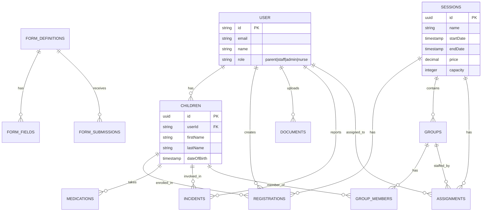

# feat: Single-Tenant Architecture Migration

**Date:** 2025-12-19
**Type:** Architectural Refactor
**Priority:** High
**Complexity:** A LOT (Comprehensive)

---

## Overview

Transform Camp OS from a multi-tenant SaaS platform (supporting multiple camp organizations) to a single-tenant application designed for a single camp to manage their operations. This involves removing all organization/tenant-related infrastructure, simplifying authentication, and restructuring routes.

---

## Problem Statement

The current architecture includes unnecessary complexity for a single-camp deployment:

1. **Multi-organization infrastructure** - Tables, middleware, and provisioning for multiple camps
2. **Super-admin layer** - Administrative portal for managing multiple organizations
3. **Organization-scoped routes** - `/org/{slug}/...` URL pattern
4. **Tenant context system** - PostgreSQL session variables for RLS
5. **Organization membership** - Complex user-to-organization relationships
6. **Subscription tiers** - SaaS billing concepts (free, pro, enterprise)

This complexity adds maintenance burden and confusion for a single-camp use case.

---

## Proposed Solution

Remove all multi-tenant infrastructure and simplify to a direct user-to-data relationship model.

### Key Changes:

1. **Remove organizations table and related infrastructure**
2. **Remove organizationId from all data tables**
3. **Remove super-admin role and portal**
4. **Simplify routes** - Remove `/org/{slug}` pattern, use `/dashboard` directly
5. **Simplify middleware** - Remove tenant context injection
6. **Simplify auth** - Remove organization membership checks
7. **Update RBAC** - Remove super_admin role, simplify permissions

---

## Technical Approach

### Architecture

```
BEFORE (Multi-tenant):
┌─────────────────────────────────────────────────────────────┐
│                      Super Admin Portal                      │
│  /super-admin/*  (manage all organizations)                  │
└─────────────────────────────────────────────────────────────┘
         │
         ▼
┌─────────────────────────────────────────────────────────────┐
│                     Organizations Table                      │
│  id | name | slug | status | subscriptionTier | ...         │
└─────────────────────────────────────────────────────────────┘
         │
         ▼
┌─────────────────────────────────────────────────────────────┐
│                   Organization Users                         │
│  organizationId | userId | role (owner/admin/member)        │
└─────────────────────────────────────────────────────────────┘
         │
         ▼
┌─────────────────────────────────────────────────────────────┐
│                    All Data Tables                           │
│  Every table has organizationId foreign key                  │
│  children, sessions, registrations, forms, etc.              │
└─────────────────────────────────────────────────────────────┘

AFTER (Single-tenant):
┌─────────────────────────────────────────────────────────────┐
│                    User Authentication                       │
│  Simple role: parent | staff | admin | nurse                │
└─────────────────────────────────────────────────────────────┘
         │
         ▼
┌─────────────────────────────────────────────────────────────┐
│                    All Data Tables                           │
│  No organizationId - direct relationships                    │
│  children → userId (parent)                                  │
│  sessions → standalone                                       │
│  registrations → userId, childId, sessionId                  │
└─────────────────────────────────────────────────────────────┘
```

### Implementation Phases

#### Phase 1: Remove Super-Admin Infrastructure

**Files to Delete:**
- `src/app/(super-admin)/super-admin/**/*` - Entire super-admin route group
- `src/components/super-admin/**/*` - All super-admin components
- `src/app/actions/super-admin-actions.ts` - Super-admin actions

**Files to Modify:**
- `src/lib/rbac.ts:13` - Remove `super_admin` from `UserRole` type
- `src/lib/rbac.ts:56-70` - Remove `super_admin` permissions block
- `src/lib/rbac.ts:222-228` - Remove `isSuperAdmin()` function
- `src/lib/rbac.ts:243` - Update `canAccessForm()` to not check super_admin
- `src/lib/auth.ts:9-13` - Remove `isSuperAdminEmail()` function
- `src/lib/auth.ts:51-66` - Remove super-admin auto-assignment hook

**Estimated Impact:** ~15 files

#### Phase 2: Remove Organization Routes and Components

**Files to Delete:**
- `src/app/org/**/*` - Entire org-scoped route group
- `src/components/org/**/*` - Org-specific components
- `src/app/actions/organization-actions.ts` - Organization actions

**Files to Modify:**
- `src/middleware.ts` - Remove organization extraction, simplify to auth-only
- `src/lib/db/tenant-context.ts` - Delete entirely (no longer needed)

**Route Restructuring:**
```
BEFORE:                          AFTER:
/org/{slug}/dashboard     →      /dashboard
/org/{slug}/settings      →      /settings
/select-organization      →      DELETE (not needed)
/super-admin/*            →      DELETE (not needed)
```

**Estimated Impact:** ~20 files

#### Phase 3: Schema Migration (Database)

**Tables to Delete:**
- `organizations` - No longer needed
- `organizationUsers` - No longer needed

**Columns to Remove from All Tables:**
```sql
-- Remove organizationId from these tables:
ALTER TABLE children DROP COLUMN organization_id;
ALTER TABLE sessions DROP COLUMN organization_id;
ALTER TABLE registrations DROP COLUMN organization_id;
ALTER TABLE incidents DROP COLUMN organization_id;
ALTER TABLE documents DROP COLUMN organization_id;
ALTER TABLE events DROP COLUMN organization_id;
ALTER TABLE groups DROP COLUMN organization_id;
ALTER TABLE assignments DROP COLUMN organization_id;
ALTER TABLE group_members DROP COLUMN organization_id;
ALTER TABLE attendance DROP COLUMN organization_id;
ALTER TABLE medication_logs DROP COLUMN organization_id;
ALTER TABLE medications DROP COLUMN organization_id;
ALTER TABLE ai_actions DROP COLUMN organization_id;
ALTER TABLE form_definitions DROP COLUMN organization_id;
ALTER TABLE form_fields DROP COLUMN organization_id;
ALTER TABLE form_options DROP COLUMN organization_id;
ALTER TABLE form_snapshots DROP COLUMN organization_id;
ALTER TABLE form_submissions DROP COLUMN organization_id;
ALTER TABLE session_forms DROP COLUMN organization_id;
```

**User Table Changes:**
```sql
ALTER TABLE "user" DROP COLUMN active_organization_id;
-- Keep role column but constrain to: parent | staff | admin | nurse
```

**Index Updates:**
- Remove all `*_org_*` indexes
- Simplify composite indexes that included organizationId

**Estimated Impact:** 19 tables

#### Phase 4: Update All Server Actions and Services

**Files Requiring organizationId Removal:**
- `src/services/registration-service.ts` - Remove org context
- `src/services/form-service.ts` - Remove org filters
- `src/services/eligibility-service.ts` - Remove org context
- `src/app/actions/form-actions.ts` - Remove org filters
- `src/app/actions/parent-actions.ts` - Remove org context
- `src/app/actions/session-actions.ts` - Remove org filters
- `src/app/actions/admin-actions.ts` - Remove org context
- `src/lib/ai-tools/form-builder-tool.ts` - Remove org context
- `src/app/api/ai/**/*.ts` - Remove org context from AI routes
- `src/app/api/sessions/**/*.ts` - Remove org context

**Pattern to Apply:**
```typescript
// BEFORE
const forms = await db.query.formDefinitions.findMany({
  where: and(
    eq(formDefinitions.organizationId, organizationId),
    eq(formDefinitions.status, "active")
  ),
});

// AFTER
const forms = await db.query.formDefinitions.findMany({
  where: eq(formDefinitions.status, "active"),
});
```

**Estimated Impact:** ~30 files

#### Phase 5: Update Dashboard Routes

**Current Structure to Simplify:**
```
src/app/(site)/dashboard/admin/**/*
src/app/(site)/dashboard/parent/**/*
src/app/(site)/dashboard/staff/**/*
src/app/(site)/dashboard/nurse/**/*
```

**Updates Required:**
- Remove organization context checks
- Remove organization-scoped queries
- Simplify header/navigation (no org switcher)

**Estimated Impact:** ~15 files

#### Phase 6: Update Onboarding Flow

**Remove Multi-org Onboarding:**
- `src/lib/provisioning/provision-organization.ts` - Delete
- `src/app/api/onboarding/route.ts` - Simplify to user signup only
- `src/components/onboarding/onboarding-form.tsx` - Remove org creation fields
- `src/types/onboarding.ts` - Simplify types

**New Onboarding Flow:**
1. User signs up (email/password or Google)
2. Admin assigns role (or auto-assign parent role)
3. User accesses dashboard based on role

**Estimated Impact:** ~5 files

---

## Alternative Approaches Considered

### 1. Soft-disable Multi-tenancy
**Rejected:** Would leave dead code and complexity in the codebase.

### 2. Use Environment Variable to Toggle
**Rejected:** Adds conditional complexity everywhere, maintenance burden.

### 3. Create Separate Single-tenant Branch
**Rejected:** Divergent codebases are hard to maintain long-term.

---

## Acceptance Criteria

### Functional Requirements
- [ ] Users can sign up and log in without organization context
- [ ] All existing features (forms, sessions, registrations) work without organization
- [ ] Admin can manage all camp data directly
- [ ] Parent can register children for sessions
- [ ] Staff can view assigned children
- [ ] No references to "organization" in UI

### Non-Functional Requirements
- [ ] All routes are simplified (no /org/{slug} pattern)
- [ ] Database queries are simpler (no organizationId filters)
- [ ] Authentication flow is streamlined
- [ ] No dead code related to multi-tenancy

### Quality Gates
- [ ] `npm run typecheck` passes
- [ ] `npm run lint` passes
- [ ] `npm run build` succeeds
- [ ] All existing tests pass (update as needed)
- [ ] Manual testing of all user flows

---

## Success Metrics

1. **Code Reduction:** Remove ~2000+ lines of multi-tenant code
2. **Simplified Schema:** Remove 2 tables, ~19 columns
3. **Faster Queries:** No unnecessary organization filters
4. **Cleaner Routes:** Direct `/dashboard` instead of `/org/{slug}/dashboard`
5. **Simpler Auth:** No organization membership checks

---

## Dependencies & Prerequisites

1. **Database Backup Required** - Before running migrations
2. **Existing Data Decision** - What to do with existing organizationId values
3. **No Active Users** - Migration should happen during maintenance window

---

## Risk Analysis & Mitigation

| Risk | Impact | Likelihood | Mitigation |
|------|--------|------------|------------|
| Data loss during migration | High | Low | Full backup before migration, test on staging |
| Broken features post-migration | High | Medium | Comprehensive testing checklist |
| Orphaned data | Medium | Low | Cascade deletes, cleanup scripts |
| Auth issues | High | Low | Keep Better Auth core, only remove org plugin |

---

## Data Migration Strategy

### Option A: Fresh Start (Recommended for development)
```bash
npm run db:reset  # Drops all tables
npm run db:push   # Creates new schema
npm run db:seed   # Seeds test data
```

### Option B: Migrate Existing Data
```sql
-- 1. Remove foreign key constraints
-- 2. Drop organization_id columns
-- 3. Drop organizations and organization_users tables
-- 4. Update indexes
-- (Requires custom migration script)
```

---

## Files to Create

### drizzle/0007_remove_multi_tenancy.sql
```sql
-- Migration to remove multi-tenant infrastructure

-- Remove organizationId from all tables
ALTER TABLE children DROP COLUMN organization_id;
ALTER TABLE sessions DROP COLUMN organization_id;
-- ... (all 19 tables)

-- Drop organization tables
DROP TABLE IF EXISTS organization_users;
DROP TABLE IF EXISTS organizations;

-- Remove activeOrganizationId from users
ALTER TABLE "user" DROP COLUMN active_organization_id;
```

### src/middleware.ts (simplified)
```typescript
import { NextResponse } from "next/server";
import type { NextRequest } from "next/server";

export async function middleware(request: NextRequest) {
  // Simple auth check only - no organization context
  return NextResponse.next();
}

export const config = {
  matcher: [
    "/((?!_next/static|_next/image|favicon.ico|.*\\.(?:svg|png|jpg|jpeg|gif|webp)$).*)",
  ],
};
```

---

## ERD After Migration



---

## Implementation Order

1. **Create database migration** (don't run yet)
2. **Update schema.ts** - Remove organizationId from all tables
3. **Delete super-admin files** - Clean removal
4. **Delete org-scoped routes** - /org/{slug}/*
5. **Simplify middleware** - Remove tenant context
6. **Update all server actions** - Remove org filters
7. **Update services** - Remove org context
8. **Update dashboards** - Remove org references
9. **Simplify onboarding** - User signup only
10. **Update RBAC** - Remove super_admin
11. **Run database migration**
12. **Update seed script**
13. **Full testing**

---

## References

### Internal References
- Current schema: `src/lib/schema.ts`
- Tenant context: `src/lib/db/tenant-context.ts`
- Middleware: `src/middleware.ts`
- RBAC system: `src/lib/rbac.ts`
- Auth config: `src/lib/auth.ts`
- Provisioning: `src/lib/provisioning/provision-organization.ts`

### Files with organizationId Usage (16 files)
- `src/services/registration-service.ts`
- `src/services/form-service.ts`
- `src/scripts/seed.ts`
- `src/app/actions/organization-actions.ts`
- `src/lib/db/tenant-context.ts`
- `src/app/api/ai/session-setup/create/route.ts`
- `src/lib/ai-tools/form-builder-tool.ts`
- `src/app/api/ai/session-setup/route.ts`
- `src/app/actions/session-actions.ts`
- `src/lib/schema.ts`
- `src/lib/provisioning/provision-organization.ts`
- `src/app/api/onboarding/route.ts`
- `src/middleware.ts`
- `src/app/actions/parent-actions.ts`
- `src/app/actions/super-admin-actions.ts`
- `src/types/onboarding.ts`

### Super-Admin Files to Delete
- `src/app/(super-admin)/super-admin/page.tsx`
- `src/app/(super-admin)/super-admin/organizations/page.tsx`
- `src/app/(super-admin)/super-admin/organizations/[id]/page.tsx`
- `src/app/(super-admin)/super-admin/users/page.tsx`
- `src/components/super-admin/organizations-table.tsx`
- `src/components/super-admin/organization-details.tsx`
- `src/components/super-admin/preview-mode-banner.tsx`
- `src/components/super-admin/super-admin-header.tsx`

### Org-Scoped Files to Delete/Modify
- `src/app/org/[slug]/layout.tsx`
- `src/app/org/[slug]/dashboard/page.tsx`
- `src/app/org/[slug]/settings/page.tsx`
- `src/components/org/org-header.tsx`

---

## Checklist Summary

### Phase 1: Super-Admin Removal
- [ ] Delete `src/app/(super-admin)/` directory
- [ ] Delete `src/components/super-admin/` directory
- [ ] Delete `src/app/actions/super-admin-actions.ts`
- [ ] Update `src/lib/rbac.ts` - Remove super_admin role
- [ ] Update `src/lib/auth.ts` - Remove super_admin auto-assignment

### Phase 2: Organization Routes Removal
- [ ] Delete `src/app/org/` directory
- [ ] Delete `src/components/org/` directory
- [ ] Delete `src/app/actions/organization-actions.ts`
- [ ] Delete `src/lib/db/tenant-context.ts`
- [ ] Delete `src/lib/provisioning/provision-organization.ts`
- [ ] Simplify `src/middleware.ts`

### Phase 3: Schema Migration
- [ ] Create migration file `drizzle/0007_remove_multi_tenancy.sql`
- [ ] Update `src/lib/schema.ts` - Remove organizationId from all tables
- [ ] Remove `organizations` and `organizationUsers` tables
- [ ] Remove `activeOrganizationId` from user table
- [ ] Update all relations

### Phase 4: Server Actions & Services
- [ ] Update `src/services/registration-service.ts`
- [ ] Update `src/services/form-service.ts`
- [ ] Update `src/app/actions/form-actions.ts`
- [ ] Update `src/app/actions/parent-actions.ts`
- [ ] Update `src/app/actions/session-actions.ts`
- [ ] Update `src/app/actions/admin-actions.ts`
- [ ] Update AI routes and tools

### Phase 5: Dashboard Updates
- [ ] Update admin dashboard pages
- [ ] Update parent dashboard pages
- [ ] Update staff dashboard pages
- [ ] Update nurse dashboard pages
- [ ] Remove org context from headers/navigation

### Phase 6: Onboarding Simplification
- [ ] Simplify `src/app/api/onboarding/route.ts`
- [ ] Simplify `src/components/onboarding/onboarding-form.tsx`
- [ ] Update `src/types/onboarding.ts`

### Phase 7: Testing & Cleanup
- [ ] Run `npm run typecheck`
- [ ] Run `npm run lint`
- [ ] Run `npm run build`
- [ ] Update `src/scripts/seed.ts`
- [ ] Run `npm run db:reset && npm run db:push && npm run db:seed`
- [ ] Manual testing of all user flows
- [ ] Update `AGENTS.md` documentation
